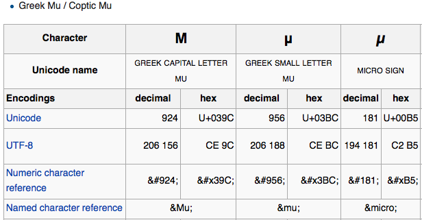
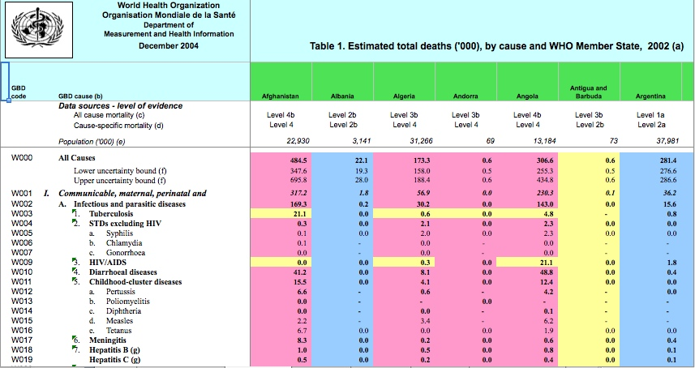
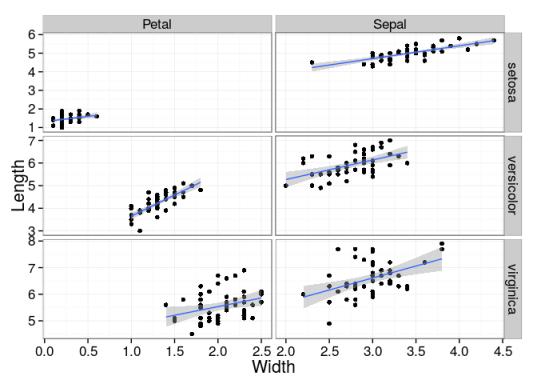

Data Files
========================================================
author: Brian High
date: February 09, 2015
transition: fade
#incremental: true

<style type="text/css">
.small-code pre code {
   font-size: .9em;
   margin-top: 0;
   white-space: pre-wrap;
}
.medium-code pre code {
   font-size: 1em;
   margin-top: 0;
   white-space: pre-wrap;
}
</style>


DEOHS Informatics
-------------------------------------------------------
[https://canvas.uw.edu/courses/974776](https://canvas.uw.edu/courses/974776)

<small style="font-size:.5em">
This work is licensed under a <a rel="license" href="http://creativecommons.org/licenses/by-sa/4.0/">Creative Commons Attribution-ShareAlike 4.0 International License</a>.<br />
<a rel="license" href="http://creativecommons.org/licenses/by-sa/4.0/"></a>
</small>


Data Files Overview
========================================================

- Data File Types: [Binary](http://en.wikipedia.org/wiki/Binary_file) 
    vs. [plain text](http://en.wikipedia.org/wiki/Plain_text)
- [Filename extensions](http://en.wikipedia.org/wiki/Filename_extension) and 
[File type associations](http://en.wikipedia.org/wiki/File_association)
- [ASCII](http://en.wikipedia.org/wiki/ASCII) and 
    [Unicode](http://en.wikipedia.org/wiki/Unicode)
- [Structured](http://en.wikipedia.org/wiki/Data_model), 
[Semi-structured](http://en.wikipedia.org/wiki/Semi-structured_data), 
and [Unstructured](http://en.wikipedia.org/wiki/Unstructured_data) data
- [XML](http://en.wikipedia.org/wiki/XML) and [JSON](http://en.wikipedia.org/wiki/JSON)
- [Delimited](http://en.wikipedia.org/wiki/Delimiter-separated_values) 
    and [Multi-Line](http://en.wikipedia.org/wiki/FASTA_format) file formats
- [Data file layout](http://blog.rstudio.org/2014/07/22/introducing-tidyr/) and
[Tidy Data](http://cran.r-project.org/web/packages/tidyr/vignettes/tidy-data.html)
    

Data File Types: Binary vs. Plain Text
========================================================

- Binary
    * Each "byte" is just "0s and 1s"
    * Format may be efficient but "closed"
    * Examples: database, multimedia, and compressed files
- Plain Text
    * [ASCII](http://en.wikipedia.org/wiki/ASCII) or [Unicode](http://en.wikipedia.org/wiki/Unicode) -- a "character" is one or more bytes
    * Format is usually "open" and standard
    * Examples: Web pages ([HTML](http://en.wikipedia.org/wiki/HTML)), 
    [XML](http://en.wikipedia.org/wiki/XML), 
    [CSV](http://en.wikipedia.org/wiki/Comma-separated_values) data files

File Name Extensions
========================================================

- End of a filename - the last "dot" and what follows it
- Binary:
    * .png, .jpeg, .exe, .dmg, .xls, .sas7bdat, .RData
- Plain Text:
    * .csv, .tsv., .txt, .R, .py, .bat, .do
- Used to determine which "default application" should open it
- [File type associations](http://en.wikipedia.org/wiki/File_association) map extensions to default applications

<small style="font-size:.5em">
Source: [Wikipedia](http://en.wikipedia.org/wiki/Filename_extension), [CC BY-SA 3.0](http://en.wikipedia.org/wiki/Wikipedia:Text_of_Creative_Commons_Attribution-ShareAlike_3.0_Unported_License)
</small>

Viewing Binary and Plain Text Files
========================================================

[Hexdecimal](http://en.wikipedia.org/wiki/Hexadecimal) is a base-16 number system with digits 0-F:
- 0 1 2 3 4 5 6 7 8 9 A B C D E F

Let's "dump" files in "hex" with [hexdump](http://en.wikipedia.org/wiki/Hex_dump)...

`$ hexdump -C -n 64 filename`

Where:

- `-C` = display in hex and ASCII
- `-n 64` = show the first 64 characters
- `filename` = name of file to view

Viewing Binary and Plain Text Files
========================================================
class: small-code

Let's view the first 64 bytes of an 
[SVG](http://en.wikipedia.org/wiki/Scalable_Vector_Graphics) 
(text) image file.

`$ hexdump -C -n 64 pie.svg`
```
00000000  3c 3f 78 6d 6c 20 76 65  72 73 69 6f 6e 3d 22 31  |<?xml version="1|
00000010  2e 30 22 20 65 6e 63 6f  64 69 6e 67 3d 22 75 74  |.0" encoding="ut|
00000020  66 2d 38 22 3f 3e 0a 3c  21 44 4f 43 54 59 50 45  |f-8"?>.<!DOCTYPE|
00000030  20 73 76 67 20 50 55 42  4c 49 43 20 22 2d 2f 2f  | svg PUBLIC "-//|
00000040
```
Now here's the 
[PNG](http://en.wikipedia.org/wiki/Portable_Network_Graphics) 
(binary) version of that same image.

`$ hexdump -C -n 64 pie.png`
```
00000000  89 50 4e 47 0d 0a 1a 0a  00 00 00 0d 49 48 44 52  |.PNG........IHDR|
00000010  00 00 01 2c 00 00 02 26  10 04 00 00 00 13 97 a3  |...,...&........|
00000020  46 00 00 00 04 67 41 4d  41 00 00 b1 8f 0b fc 61  |F....gAMA......a|
00000030  05 00 00 00 20 63 48 52  4d 00 00 7a 26 00 00 80  |.... cHRM..z&...|
00000040
```

Character Encodings
========================================================

We will take a closer look at the most popular character encodings for text files.

- [ASCII](http://en.wikipedia.org/wiki/ASCII) (7-bit)
- [Extended ASCII](http://en.wikipedia.org/wiki/Extended_ASCII) (8-bit)
- [Unicode](http://en.wikipedia.org/wiki/Unicode) (1-4 bytes)
- Note: 8 [bits](http://en.wikipedia.org/wiki/Bit) 
per [byte](http://en.wikipedia.org/wiki/Byte)

----



<small style="font-size:.5em">
Source: [Wikipedia, CC BY-SA 3.0](http://en.wikipedia.org/wiki/Mu_%28letter%29#Character_Encodings)
</small>

ASCII
========================================================

- "American Standard Code for Information Interchange"
- [ASCII](http://en.wikipedia.org/wiki/ASCII) standard first published in 1963
- Current version of US ASCII is [ANSI](http://en.wikipedia.org/wiki/American_National_Standards_Institute) X3.4-1986
- ASCII was internationalized as [ISO 646:1983](http://en.wikipedia.org/wiki/ISO/IEC_646)
- 7-bit character set with 128 characters (2^7 = 128)

<small style="font-size:.5em">
Source: [Wikipedia](http://en.wikipedia.org/wiki/ASCII), [CC BY-SA 3.0](http://en.wikipedia.org/wiki/Wikipedia:Text_of_Creative_Commons_Attribution-ShareAlike_3.0_Unported_License)
</small>

ASCII Table
========================================================
class: small-code

The `ascii` command prints all 128 ASCII characters.

`$ ascii`

```
Usage: ascii [-dxohv] [-t] [char-alias...]
   -t = one-line output  -d = Decimal table  -o = octal table  -x = hex table
   -h = This help screen -v = version information
Prints all aliases of an ASCII character. Args may be chars, C \-escapes,
English names, ^-escapes, ASCII mnemonics, or numerics in decimal/octal/hex.

Dec Hex    Dec Hex    Dec Hex  Dec Hex  Dec Hex  Dec Hex   Dec Hex   Dec Hex  
  0 00 NUL  16 10 DLE  32 20    48 30 0  64 40 @  80 50 P   96 60 `  112 70 p
  1 01 SOH  17 11 DC1  33 21 !  49 31 1  65 41 A  81 51 Q   97 61 a  113 71 q
  2 02 STX  18 12 DC2  34 22 "  50 32 2  66 42 B  82 52 R   98 62 b  114 72 r
  3 03 ETX  19 13 DC3  35 23 #  51 33 3  67 43 C  83 53 S   99 63 c  115 73 s
  4 04 EOT  20 14 DC4  36 24 $  52 34 4  68 44 D  84 54 T  100 64 d  116 74 t
  5 05 ENQ  21 15 NAK  37 25 %  53 35 5  69 45 E  85 55 U  101 65 e  117 75 u
  6 06 ACK  22 16 SYN  38 26 &  54 36 6  70 46 F  86 56 V  102 66 f  118 76 v
  7 07 BEL  23 17 ETB  39 27 '  55 37 7  71 47 G  87 57 W  103 67 g  119 77 w
  8 08 BS   24 18 CAN  40 28 (  56 38 8  72 48 H  88 58 X  104 68 h  120 78 x
  9 09 HT   25 19 EM   41 29 )  57 39 9  73 49 I  89 59 Y  105 69 i  121 79 y
 10 0A LF   26 1A SUB  42 2A *  58 3A :  74 4A J  90 5A Z  106 6A j  122 7A z
 11 0B VT   27 1B ESC  43 2B +  59 3B ;  75 4B K  91 5B [  107 6B k  123 7B {
 12 0C FF   28 1C FS   44 2C ,  60 3C <  76 4C L  92 5C \  108 6C l  124 7C |
 13 0D CR   29 1D GS   45 2D -  61 3D =  77 4D M  93 5D ]  109 6D m  125 7D }
 14 0E SO   30 1E RS   46 2E .  62 3E >  78 4E N  94 5E ^  110 6E n  126 7E ~
 15 0F SI   31 1F US   47 2F /  63 3F ?  79 4F O  95 5F _  111 6F o  127 7F DEL
 ```

Extended ASCII
========================================================

- [ISO-8859-1](http://en.wikipedia.org/wiki/ISO/IEC_8859-1) is an 8-bit extension with 191 characters
- ISO-8859-1 ("ISO Latin 1") was first published in 1987
- ISO-8859-1 was extended to [Windows-1252](http://en.wikipedia.org/wiki/Windows-1252)
- Windows-1252 is sometimes (incorrectly) called "ANSI"

<small style="font-size:.5em">
Source: [Wikipedia](http://en.wikipedia.org/wiki/Windows-1252), [CC BY-SA 3.0](http://en.wikipedia.org/wiki/Wikipedia:Text_of_Creative_Commons_Attribution-ShareAlike_3.0_Unported_License)
</small>

----


<small style="font-size:.5em">
Source: [Keith111, CC BY-SA 3.0, (Wikimedia)](http://commons.wikimedia.org/wiki/File:Windows-1252.svg)
</small>

Unicode
========================================================

[Unicode](http://en.wikipedia.org/wiki/Unicode) provides an 
[internationalized](http://en.wikipedia.org/wiki/Internationalization_and_localization) character encoding *standard*, to ...

> "encompass the characters of all the world's living languages"

-- Joe Becker, [Unicode 88](http://www.unicode.org/history/unicode88.pdf)

- Like ASCII, but supports over 110,000 characters
- Unicode standard was published in 1991
- Most commonly used *encodings* are UTF-8 and UTF-16

<small style="font-size:.5em">
Source: [Wikipedia](http://en.wikipedia.org/wiki/Unicode), [CC BY-SA 3.0](http://en.wikipedia.org/wiki/Wikipedia:Text_of_Creative_Commons_Attribution-ShareAlike_3.0_Unported_License)
</small>

UTF-8: Encoding the Unicode Code Space
========================================================

- [UTF-8](http://en.wikipedia.org/wiki/UTF-8) (1993) is a variable-length 8-bit 
character encoding
- A UTF-8 character will use one to four 8-bit bytes
- ASCII characters are the first 128 characters of UTF-8
- Use of UTF-8 surpassed ASCII on the Web in Dec. 2007
- UTF-8 is the default encoding for HTML5 and JSON

> "UTF-8 and UTF-16 are the standard encodings for Unicode text in HTML 
documents, with UTF-8 as the preferred and most used encoding."

-- Wikipedia

<small style="font-size:.5em">
Source: [Wikipedia](http://en.wikipedia.org/wiki/UTF-8), [CC BY-SA 3.0](http://en.wikipedia.org/wiki/Wikipedia:Text_of_Creative_Commons_Attribution-ShareAlike_3.0_Unported_License)
</small>

Example: Encoding the Micro Sign
======================================

The character <i>&micro;</i>, with Unicode **name** "MICRO SIGN" is encoded:

| Encodings     |**decimal**     | **hex**     |
| ------------- | -------------- | ----------- |
| Unicode       | 181            | U+00B5      |
| Extended ASCII | 181           | B5          |
| HTML *numeric* character reference  | `&#181;` | `&#xB5;` |
| HTML *named* character entity       | `&micro;`   |

<small style="font-size:.5em">
Source: [Wikipedia](http://en.wikipedia.org/wiki/Unicode), [CC BY-SA 3.0](http://en.wikipedia.org/wiki/Wikipedia:Text_of_Creative_Commons_Attribution-ShareAlike_3.0_Unported_License)
</small>

Example: Typing the Micro Sign
======================================

How do you type the <i>&micro;</i> character into your computer?

**name** = `MICRO SIGN`, **decimal** = `181`, **hex** = `00B5`

- *Windows*: [Alt]***decimal*** using numeric keypad _or_ ...
    * ***hex***[Alt][x] ... does not require numeric keypad
- *OSX*: for <i>&micro;</i>, you can simply use [Opt][m] _or_ ...
    * [Command][Ctrl][Space] ... Search by ***name***
    * _or_ use *Unicode Hex Input* (Input Source) and [Opt]***hex***
- *Linux*: [Shift][Ctrl][u]***hex***

<small style="font-size:.5em">
Source: [Wikipedia](http://en.wikipedia.org/wiki/Unicode_input#In_Microsoft_Windows), [CC BY-SA 3.0](http://en.wikipedia.org/wiki/Wikipedia:Text_of_Creative_Commons_Attribution-ShareAlike_3.0_Unported_License)
</small>

Some Other Useful Symbols
======================================
class: medium-code

```
Character Name            Char.   Entity    Num. Entity   Hex. Entity
--------------            -----   --------  -----------   -----------
DEGREE SYMBOL                °    &deg;          &#176;        &#xB0;
MICRO MU SYMBOL              µ    &micro;        &#181;        &#xB5;
LOWER CASE SIGMA             σ    &sigma;        &#963;       &#x3C3;
N-ARY SUMMATION              ∑    &sum;         &#8721;      &#x2211;
GREEK SMALL LETTER PI        π    &pi;           &#960;       &#x3C0;
GREEK SMALL LETTER ALPHA     α    &alpha;        &#945;       &#x3B1;
GREEK SMALL LETTER BETA      β    &beta;         &#946;       &#x3B2;
GREEK SMALL LETTER GAMMA     γ    &gamma;        &#947;       &#x3B3;
INCREMENT                    Δ    &Delta;       &#8710;      &#x2206;
GREEK SMALL LETTER EPSILON   ε    &epsilon;      &#949;       &#x3B5;
INFINITY                     ∞    &infin;       &#8734;      &#x221E;
PLUS OR MINUS                ±    &plusmn;       &#177;        &#xB1;
NOT EQUALS                   ≠    &ne;          &#8800;      &#x2260;
ALMOST EQUAL                 ≈    &asymp;       &#8776;      &#x2248;
GREATER THAN OR EQUAL TO     ≥    &ge;          &#8805;      &#x2265;
LESS THAN OR EQUAL TO        ≤    &le;          &#8804;      &#x2264;
DIVISION SIGN                ÷    &divide;       &#247;        &#xF7;
SUPERSCRIPT TWO              ²    &sup2;         &#178;        &#xB2;
SUPERSCRIPT THREE            ³    &sup3;         &#179;        &#xB3;
```

For example, in Windows, you can use the "Num. Entity" column for [Alt] 
codes such as [Alt]946 for β (beta).

Data Structure
========================================================

- [Structured](http://en.wikipedia.org/wiki/Data_model): Formal and rigorous design
    * Example: [Relational database](http://en.wikipedia.org/wiki/Relational_database)
- [Semi-structured](http://en.wikipedia.org/wiki/Semi-structured_data): 
[Self-describing](http://en.wikipedia.org/wiki/Self-documenting), validatable
    * [Markup](http://en.wikipedia.org/wiki/Markup_language) using 
    [tags](http://en.wikipedia.org/wiki/HTML_element) or 
    [key-value pairs](http://en.wikipedia.org/wiki/Attribute%E2%80%93value_pair)
    * Examples: [XML](http://en.wikipedia.org/wiki/XML) and 
    [JSON](http://en.wikipedia.org/wiki/JSON)
- [Unstructured](http://en.wikipedia.org/wiki/Unstructured_data): 
    * Multimedia and text document files
    * Any internal structure, if present, is assumed or unreliable
    * Example: email "body" ("header" is semi-structured)
    * May have "implied" structure, like "delimited text"

XML
========================================================

- Self-describing
- Structured
- Standard
- Parsable with libraries
- Examples: 
    * [XHTML](http://en.wikipedia.org/wiki/XHTML)
    * [KML](http://en.wikipedia.org/wiki/Keyhole_Markup_Language)
    * [XLSX](http://en.wikipedia.org/wiki/Office_Open_XML)
    * [p-list](http://en.wikipedia.org/wiki/Property_list#Mac_OS_X)
    * [SVG](http://en.wikipedia.org/wiki/Scalable_Vector_Graphics)

<small style="font-size:.5em">
Source: [Wikipedia](http://en.wikipedia.org/wiki/XML), [CC BY-SA 3.0](http://en.wikipedia.org/wiki/Wikipedia:Text_of_Creative_Commons_Attribution-ShareAlike_3.0_Unported_License)
</small>

----


<small style="font-size:.5em">
Source: [en:User:Dreftymac, CC BY 2.5, (Wikimedia)](http://commons.wikimedia.org/wiki/File:XHTML.svg)
</small>


JSON
========================================================
class: small-code

- [JavaScript Object Notation](http://en.wikipedia.org/wiki/JSON)
- Open format (ISO and ECMA standards)
- Human-readable text
- For transmiting data objects
- Attribute–value pairs
- Often used in [Ajax](http://en.wikipedia.org/wiki/Ajax_%28programming%29) 
web applications

<small style="font-size:.5em">
Source: [Wikipedia](http://en.wikipedia.org/wiki/JSON), [CC BY-SA 3.0](http://en.wikipedia.org/wiki/Wikipedia:Text_of_Creative_Commons_Attribution-ShareAlike_3.0_Unported_License)
</small>

----

```
{
  "firstName": "John",
  "lastName": "Smith",
  "isAlive": true,
  "age": 25,
  "height_cm": 167.6,
  "address": {
    "streetAddress": "21 2nd Street",
    "city": "New York",
    "state": "NY",
    "postalCode": "10021-3100"
  },
  "phoneNumbers": [
    {
      "type": "home",
      "number": "212 555-1234"
    },
    {
      "type": "office",
      "number": "646 555-4567"
    }
  ],
  "children": [],
  "spouse": null
}
```

Delimited Text Files
========================================================

Files formated with [delimiter separated values](http://en.wikipedia.org/wiki/Delimiter-separated_values) use:

- Comma (e.g., "CSV")
- Tab (e.g., "TSV")
- Pipe (vertical bar: |)

... or other single character as a separator between values.

----

The records (rows) are separated by 
[line-ending](http://en.wikipedia.org/wiki/Newline) characters (newlines):

- Carriage-return (CR)
- Line-feed (LF)
- Carriage-return, Line-feed (CRLF)

Fixed-Width Text Files
========================================================

- Text files arranged in neatly formatted columns
- Space filled with varying numbers of spaces or tabs
- Easier to look at, but a little harder to parse
- Lines are separated with newlines


```
                   mpg cyl disp
Mazda RX4         21.0   6  160
Mazda RX4 Wag     21.0   6  160
Datsun 710        22.8   4  108
Hornet 4 Drive    21.4   6  258
Hornet Sportabout 18.7   8  360
Valiant           18.1   6  225
```

<small style="font-size:.6em">
Data from [mtcars](https://stat.ethz.ch/R-manual/R-devel/library/datasets/html/mtcars.html), 
The R Datasets Package, R Core Team. Extracted from the 1974 *Motor Trend* US magazine. 
Source: Henderson and Velleman (1981), Building multiple regression models interactively. 
*Biometrics*, 37, 391–411.
</small>


Multi-line Text Files
========================================================
class: small-code

Some popular genomics file formats use multi-line records.

- [FASTA](http://en.wikipedia.org/wiki/FASTA_format)

```
>gi|5524211|gb|AAD44166.1| cytochrome b [Elephas maximus maximus]
LCLYTHIGRNIYYGSYLYSETWNTGIMLLLITMATAFMGYVLPWGQMSFWGATVITNLFSAIPYIGTNLV
EWIWGGFSVDKATLNRFFAFHFILPFTMVALAGVHLTFLHETGSNNPLGLTSDSDKIPFHPYYTIKDFLG
LLILILLLLLLALLSPDMLGDPDNHMPADPLNTPLHIKPEWYFLFAYAILRSVPNKLGGVLALFLSIVIL
GLMPFLHTSKHRSMMLRPLSQALFWTLTMDLLTLTWIGSQPVEYPYTIIGQMASILYFSIILAFLPIAGX
IENY
```
<small style="font-size:.5em">
Source: [Wikipedia](http://en.wikipedia.org/wiki/FASTA_format), [CC BY-SA 3.0](http://en.wikipedia.org/wiki/Wikipedia:Text_of_Creative_Commons_Attribution-ShareAlike_3.0_Unported_License)
</small>

- [FASTQ](http://en.wikipedia.org/wiki/FASTQ_format)

```
@SRR001666.1 071112_SLXA-EAS1_s_7:5:1:817:345 length=36
GGGTGATGGCCGCTGCCGATGGCGTCAAATCCCACC
+SRR001666.1 071112_SLXA-EAS1_s_7:5:1:817:345 length=36
IIIIIIIIIIIIIIIIIIIIIIIIIIIIII9IG9IC
```
<small style="font-size:.5em">
Source: [Wikipedia](http://en.wikipedia.org/wiki/FASTQ_format), [CC BY-SA 3.0](http://en.wikipedia.org/wiki/Wikipedia:Text_of_Creative_Commons_Attribution-ShareAlike_3.0_Unported_License)
</small>

Data File Layout: Tidy Data
========================================================

Structure data files as simple "columns and rows" ...

|subID|height|weight|
|-----|------|------|
|    1|    58|   115|
|    2|    59|   117|
|    3|    60|   120|

... to make them easier to import and analyze.

<small style="font-size:.6em">
Data from [women](https://stat.ethz.ch/R-manual/R-patched/library/datasets/html/women.html), 
The R Datasets Package, R Core Team. Source: *The World Almanac and Book of Facts*, 1975. 
Reference: McNeil, D. R. (1977) *Interactive Data Analysis*. Wiley.
</small>

----

The basic tenets of *[tidy data](http://vita.had.co.nz/papers/tidy-data.pdf)*:
<small style="font-size:.9em">
<ol>
<li>Each variable forms a column.
<li>Each observation forms a row.
<li>Each type of observational unit forms a table
</ol>
</small>

<small style="font-size:.6em">
Source: Hadley Wickham, [Tidy Data](http://vita.had.co.nz/papers/tidy-data.pdf)
</small>

Data File Layout: Tidy Data
=======================================================

Is this spreadsheet *tidy data* or not? Why or why not?



<small style="font-size:.6em">
Source: [WHO](http://www.who.int/healthinfo/statistics/bodgbddeathdalyestimates.xls)
</small>

Wide and Long: Which Table is Tidier?
=======================================================

|Sepal.Length|Sepal.Width|Petal.Length|Petal.Width|Species    |
| ---------- | --------- | ---------- | --------- | --------- |
|5.1         |3.5        |1.4         |0.2        |setosa     |
|5.7         |2.8        |4.1         |1.3        |versicolor |

|Flower.Id    |Species    |Flower.Part |Length |Width|
| ----------- | --------- | ---------- | ----- | --- |
|1            |setosa     |Petal       |1.4    |0.2  |
|1            |setosa     |Sepal       |5.1    |3.5  |
|100          |versicolor |Petal       |4.1    |1.3  |
|100          |versicolor |Sepal       |5.7    |2.8  |

<small style="font-size:.6em">
Data from [iris](https://stat.ethz.ch/R-manual/R-patched/library/datasets/html/iris.htmll), 
The R Datasets Package, R Core Team. Source: Anderson, Edgar (1935). The irises of the Gaspe Peninsula, *Bulletin of the American Iris Society*, 59, 2–5. 
Reference: Fisher, R. A. (1936) The use of multiple measurements in taxonomic problems. *Annals of Eugenics*, 7, Part II, 179–188.
</small>

Why does tidiness matter?
========================================================
class: small-code

Now we can "facet" a plot by `Species` and `Flower.Part`.

```
ggplot(data=iris, aes(x=Width, y=Length)) + 
    geom_point() + facet_grid(Species ~ Flower.Part, scale="free") +
    geom_smooth(method="lm") + theme_bw(base_size=16)
```



