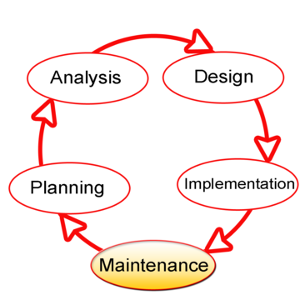

## Information System Components

<small style="font-size:.5em">
Image: Gustavb, CC BY-SA 3.0, (Wikimedia)
</small>

 
 
 

- [Hardware](http://en.wikipedia.org/wiki/Computer_hardware) (machinery)
- [Software](http://en.wikipedia.org/wiki/Software) (OS + apps)
- [Data](http://en.wikipedia.org/wiki/Data_%28computing%29) (facts)
- Procedures (policies)
- People ...
    * The most important component!

<small style="font-size:.7em">
Source: [Wikipedia](http://en.wikipedia.org/wiki/Information_system#Components), [CC BY-SA 3.0](http://en.wikipedia.org/wiki/Wikipedia:Text_of_Creative_Commons_Attribution-ShareAlike_3.0_Unported_License)
</small>

## Information System Types

- [Search](http://en.wikipedia.org/wiki/Web_search_engine) - [Search engines](http://en.wikipedia.org/wiki/Search_engine_%28computing%29),  [Google Search](http://en.wikipedia.org/wiki/Google_Search), [PubMed](http://en.wikipedia.org/wiki/PubMed)
- [Spatial](http://en.wikipedia.org/wiki/Geographic_information_system) - [Geographic information system (GIS)](http://en.wikipedia.org/wiki/Geographic_information_system), [ArcGIS](http://en.wikipedia.org/wiki/ArcGIS), [QGIS](http://en.wikipedia.org/wiki/QGIS)
- [Global](http://en.wikipedia.org/wiki/Global_information_system) - GLIS, Global Health Databases ([UNHCR](http://www.unhcr.org/pages/49c3646c4d6.html), [GHO](Global Health Observatory))
- [Enterprise](http://en.wikipedia.org/wiki/Enterprise_systems) - [Enterprise Resource Planning (ERP)](http://en.wikipedia.org/wiki/Enterprise_resource_planning)
- [Expert](http://en.wikipedia.org/wiki/Expert_systems) - Diagnosis, forecasting, delivery scheduling
- [Office](http://en.wikipedia.org/wiki/Office_automation) - [Business Process Automation (BPA)](http://en.wikipedia.org/wiki/Business_process_automation)
- [Personal](http://en.wikipedia.org/wiki/Personal_information_manager) - Communications, [calendaring](http://en.wikipedia.org/wiki/Calendaring_software), journaling/notes

<small style="font-size:.5em">
Source: [Wikipedia](http://en.wikipedia.org/wiki/Information_system#Types_of_information_systems), [CC BY-SA 3.0](http://en.wikipedia.org/wiki/Wikipedia:Text_of_Creative_Commons_Attribution-ShareAlike_3.0_Unported_License)
</small>

## Systems Development

<small style="font-size:.5em">
Image: Dzonatas, CC BY-SA 3.0, (Wikimedia)
</small>

 
 

- *[Systems Development Life Cycle](http://en.wikipedia.org/wiki/Systems_development_life_cycle)*

    * [Planning](http://en.wikipedia.org/wiki/Systems_development_life_cycle#System_investigation) 
        - [Feasibility Study](http://en.wikipedia.org/wiki/Feasibility_study)
    * [Analysis](http://en.wikipedia.org/wiki/Systems_development_life_cycle#System_analysis)
    * [Design](http://en.wikipedia.org/wiki/Systems_development_life_cycle#Design)
    * [Implementation](http://en.wikipedia.org/wiki/Implementation#Information_Technology_.28IT.29)
    * [Maintenance](http://en.wikipedia.org/wiki/Software_maintenance)

<small style="font-size:.5em">
Source: [Wikipedia](http://en.wikipedia.org/wiki/Systems_development_life_cycle), [CC BY-SA 3.0](http://en.wikipedia.org/wiki/Wikipedia:Text_of_Creative_Commons_Attribution-ShareAlike_3.0_Unported_License)
</small>

## Transparency

Information systems vary in the transparency of the their implementations, in terms of both standards and implementation.

- Open ([standards](http://en.wikipedia.org/wiki/Open_standard), [source](http://en.wikipedia.org/wiki/Open_source))
- Closed ([proprietary](http://en.wikipedia.org/wiki/Proprietary_software))
    * [Shareware](http://en.wikipedia.org/wiki/Shareware), Trialware
    * [Commercial software](http://en.wikipedia.org/wiki/Commercial_software): proprietary or open

 
 
 

* The documentation for an **open standard** is open to the public and anyone can create a software that implements and uses the standard.

* The documentation and specification for **closed standards** are not available to the public.

<small style="font-size:.5em">
Source: [Wikipedia](http://en.wikipedia.org/wiki/Software_standard#Open_v._closed_standards), [CC BY-SA 3.0](http://en.wikipedia.org/wiki/Wikipedia:Text_of_Creative_Commons_Attribution-ShareAlike_3.0_Unported_License)
</small>

