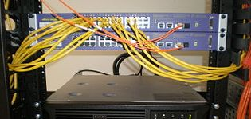
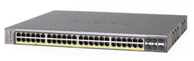

Computer Networking
========================================================
author: Jim Hogan
date: 2015-01-14
transition: fade
incremental: true

Research Computing and Data Management
-------------------------------------------------------
[http://github.com/brianhigh/research-computing](http://github.com/brianhigh/research-computing)

<small style="font-size:.5em">
This work is licensed under a <a rel="license" href="http://creativecommons.org/licenses/by-sa/4.0/">Creative Commons Attribution-ShareAlike 4.0 International License</a>. 

</small>

Introduction
========================================================

* A 30-minute introduction
* Some historical background
* The purpose
* Evolution to contemporary computer networks
* Key technical aspects including:
  + networking topologies
  + protocols and standards 
  + networking system components
  
Networking History
================================================================
 

Networking History
================================================================

### 1792

----

### Chappe Telegraph

]

Moving Along 
================================================================

### 1889

-----

### 1943

Enter Binary
======================================================

## 10000000010111110111000000000001

Some Binary Basics
=======================================================

Recognize this number?

  128.95.112.1
  
How about this one?

  10000000010111110111000000000001

Question
==================================================================

>Would not Morse code be considered a binary communication protocol?

Computer Networks: What's the Point?
========================================================

1. Allow a computer system/device to communicate with another computer system by exchanging data
2. Allow humans to interact with computer systems
3. Allow humans to interact with other humans. 

 
Contemporary Computer Networks: Key Elements
==================================================================

* Binary Operation
* Packet Switching
* Protocols

Another biggie:

* Layered Model

And some other bits:

* software and hardware components
* network topologies
* network speeds
* more...

Protocols, Standards and Governing Bodies
=============================================================
 International Telecommunicatios Union

 Internet Engineering Task Force

The TCP/IP Protocol Suite
==============================================================

* Embodied in documents called "RFCs" (Request For Comment)
* Many design decisions around factors like efficiency and reliability
* Some protocols humorously start with the word "Simple" or "Lightweight"."

Questions
==============================================================
> How many different protocols are under the TCP/IP umbrella?

> What is ICANN?  IANA?

Packet Switching and Routing Metrics
=============================================================
* Hops
* Latency
* Congestion
* Queuing

Routing: a Traceroute Example
=============================================================
          
http://www.monitis.com/traceroute/

Resolution of Names and Addresses
==============================================================

* DNS: phage.deohs.washington.edu => 128.95.230.32
* ARP: 128.95.230.32 => 26:a5:b7:20:f0:35

Question
=============================================================
> What were the design goals of ARPANET?

Data Flow of the Layered TCP/IP Model
=============================================================

[The Internet Protocol Suite Wikipedia Page](http://en.wikipedia.org/wiki/Internet_protocol_suite)

Layers, Protocols, and Encapsulation
=============================================================
(Not translated from the Dutch)

Types of Networks
=============================================================

* LAN - Local Area Network
* WAN - Wide Area Network

* LAN - less need for routing
* WAN - more need for routing

Topologies and the Networking Layer
=============================================================

 

* Mesh, Star and Tree arguably more common in this era 
* Complex networks can combine elements of several topologies

Link Layer Technologies (Ethernet Rules!)
==============================================================

From bus-based in the 80s 

To the familiar RJ45

----
Over copper and fiber media

All standards thanks to

Network Speeds
=======================================================

Familiar Speeds in Common Use:

10 Mbps - Ethernet 10BaseT - outmoded

100 Mbps - "Fast Ethernet" - still very common

1000 Mbps - "Gigabit Ethernet or 1Gbps" - typical in new devices

Faster speeds possible but expensive. 

Primary Networking Devices
========================================================

* switches
* router

* access point

----
Devices may combine functions and be hard to distinguish by appearance.

Using the Network Effectively
========================================================

* network could be performance bottleneck
* wired connection more reliable than wireless
* read and write speed to local disk always faster
* troubleshooting: 
  + start with closest component
  + learn how to use simple tool "ping"
  + get a grip on name resolution/DNS
  + know how to determine your IP address
  
[Networking on Computing Basics Wiki](https://github.com/brianhigh/computing-basics/wiki/networking)
