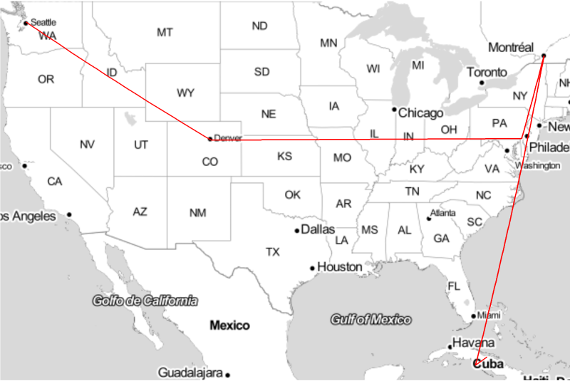
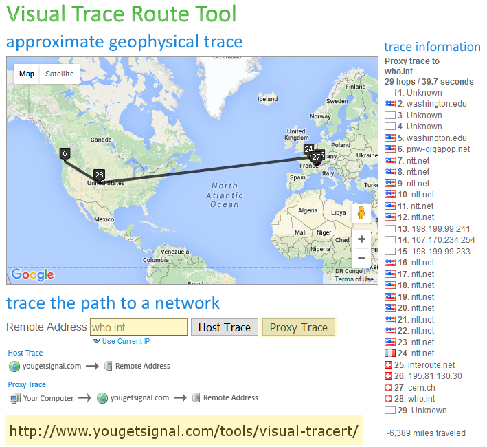

## Research Computing and Data Management – Lab 2

### Expectations and Grading

This lab assignment is worth two points of your participation grade. You
will be required to turn in (through Canvas) evidence of your work (as
described below). The assignment is due one hour after the end of the
class session. Late lab submissions will lose one point.

### Ask for help

Ask for help if you run into trouble. We will have some helpers
available, so just raise your hand (or put a sticky note on your
monitor) if you need help.

***Before proceeding, please read the DISCLAIMER.***

## DISCLAIMER

While we encourage you to explore the capabilities and operation of your own 
personal computing devices, we caution you that the activities described in 
this course (and its laboratory exercises) do carry some risk to the computing 
device used. For this reason, we conduct the lab exercises in a classroom with 
computers provided for each student and we also provide access to a server 
which is managed on your behalf.

We are unable to provide repair services in the event that your own personal 
equipment malfunctions due to any of the activities suggested in the exercises 
or any other activity related to this course. If you choose to use your own 
personal equipment for the purposes of this course, please be aware that it 
will be your responsibility to address and correct any problems with your own 
personal equipment or data. We strongly encourage making backups of your 
important user documents and system files before attempting modifications to 
your computer such as the installation of new software or the configuration of 
system properties.

Please consult authoritative documentation and seek qualified assistance if you 
need help making backups or any other operation pertaining to the administration 
of your personal devices.

## 1. Networking - 1 pt

### Network Speed

Last time we noticed some performance issues when we tried to install software
to the U drive. We will spend a few minutes looking at this issue. We will 
check our Ethernet connection speed from Windows and from DOS (or Powershell).

#### Discussion:

Do you believe that this
speed is actually what you are getting when you try to connect to the U drive?
Why might this speed be misleading? What could present a bottleneck?

#### What to turn in: 

Please save and turn in the text output from the command which shows your link
speed. We will show you how to capture this as text. 

### Connecting to our server

We have a server set up for us in this course. It is called "Phage". We will
show you how to connect with your web browser, an SSH client, and an SFTP
client. You will want to try connecting using each of those tools. Then we
will also demonstrate connecting with X2Go, but we will not ask you to connect
like this. You are however, encouraged to give it a try if you are interested.

#### Discussion:

Why might we prefer to use a server for our coursework or research versus a
desktop computer (like those in the lab) or a laptop? What if the server
was "in the cloud"? What are some reasons why we might prefer a desktop or
laptop computer over a server?

#### What to turn in: 

There is nothing to turn in for this lab exercise.

### Explore with command-line utilities 

We will be using
various tools to explore the structure, features, and protocols of the
Internet. Please upload your command history and command output from the
"terminal" or "shell" (Bash, DOS, and/or PowerShell) as a text file to
Canvas. Your output should demonstrate use of the commands: *ping*,
*traceroute* (or *tracert*), *whois* (or *New-WebServiceProxy*
and *GetWhoIs*), and *dig* (or *host -a*, or *nslookup -query=any*, or
*Resolve-DnsName*). Feel free to try the tools from the server. We will
demonstrate how to run them from Windows and from the server (Linux). We may
also connect to a Mac OSX system and demonstrate some of the tools there.

#### What to turn in:

You will be expected to turn in your command history and output into
Canvas, either as pasted text or as a plain-text file (with a `.txt` file
suffix) attachment. (We used this same method for last week's lab also.)

### Visualize with route maps

You will also be making some
network route maps. Please upload at least one network route map that
you have made to Canvas as a PNG file (`.png`). Here is an example: 



*Note*: Do not simply upload the example maps provided for you. That would be
too easy.

#### What to turn in: 

***You will be shown*** how to create these maps using
software we have written (in R) for the purposes of this course. You will also
see how to use an online alternative with your web browser. Here is an example:



To save an image like this, you may choose to make a screenshot. Your saved 
image will need to be a PNG file with a `.png` file suffix or a PDF file. You 
can make a screenshot in Windows using *Alt-PrtScn* and paste from the "clipboard" 
into a program like [MS-Paint](https://en.wikipedia.org/wiki/Paint_%28software%29), 
[IrfanView](http://www.irfanview.com/), [Gimp](https://www.gimp.org/), 
[GimpShop](https://www.gimpshop.com/), [Photoshop](http://www.photoshop.com/), 
etc., to save the image as PNG. You can also paste directly from the clipboard
into MS-WordPad or MS-Word, but be sure to export the resulting document as a 
PDF file. Please upload your file to Canvas with your other lab submissions.

*Tip*: IrfanView is free, small, simple, and fast. A 
[PortableApp version](http://portableapps.com/apps/graphics_pictures/irfanview_portable) 
is also available for IrfanView.

### Verbalize your discoveries

Please also write a short
paragraph explaining what you learned in today's networking exercises
that was new and interesting to you. How has this knowledge changed your
view of how the Internet works? Be prepared to share your insights
during a short class discussion.

#### What to turn in: 

Your written paragraph can be entered directly as text
into Canvas or you can upload a plain text (`.txt`) file or `.pdf` file 
containing this paragraph.

## Information Security - 1 pt

### See network data in transit

First, we will be look at the
flow and contents of network data packets as they leave and enter our
own computers. This will reveal what sorts of information someone else
could see if they had the motivation, knowledge and skills to peer into
your network traffic. To do so, we will use various network monitoring
and packet sniffing tools.

#### Note:

> Tools that perform encryption or network reconnaissance may have
> [legal](http://mcaf.ee/cryptolaw) or institutional restrictions on their
> use. Please consult with your information security officer for details.

#### Software Installation:

For this exercise, you will need to install the application listed below. As 
we do not *entirely* trust this application, please do *not* install it on your 
personal computer and please *reboot* your PC *after* you are done with this 
exercise so that the lab PC will be restored to its original state.

-   [York](http://thesz.diecru.eu/content/york.php)

To consider: Why might we distrust this application? Why might we feel this
is worth the risk to use it? What are our alternatives?

#### What to turn in:

Please turn in text command and output captures and/or screen captures, as you 
did in the networking module (above).

### Use encryption to protect data

Next, we will repeat some of the previous exercises after we have enabled 
encryption.

#### What to turn in:

Again, turn in text and/or images which demonstrate that you have
successfully completed these exercises. As before, more details will be
provided during the lab on exactly what to do and how to demonstrate it.

### Further protect data with backups

Last, if we have time, we
will investigate some tools to backup files securely and discuss their
differences and trade-offs. Cloud services are becoming increasingly
popular for this, at great convenience, but what risks do they introduce
and how might we mitigate them? How could encryption help and how could we
implement it in our backup system as easily and securely as possible?

We have a DOS script we have shared with you through Canvas which you can use 
on Windows to "mirror" a folder and then "sync" it once it has been mirrored.
Feel free to give this a try with a folder on your computer. You can mirror
it "to" or "from" the U:\ drive and then try a sync after changing a file. Was
the sync faster that the original mirror? If so, what made it faster? Would
simply copying the entire folder over (each time you sync) be just as fast?

There are other fancier backup tools, of course. The purpose of sharing this
simple script is to show how backups can be implemented with basic tools. An
option that will provide a graphical user interface and strong encryption is
[Duplicati](http://www.duplicati.com/). We will not have time to try this in
the lab, but you might like to explore it (or other similar tools) on your own.

#### What to turn in:

If you give this script a try, please turn in the first few lines of the log
which show the RoboCopy options and arguments and last few lines of the log
which indicate the transfer stats for the mirror/sync operation. This will
indicate that you have successfully used this script to perform the backup. You
do not need to turn in the whole logfile, nor do we need to see anything in
the logfile found between those two sections of the file, such as the long
list of filenames.

Here is an example of how you can easily capture the beginning and ending of 
the logfile using the `head` and `tail` commands from the `bash` shell:

```
sh-3.1$ head -20 backup.log > backup_report.txt
sh-3.1$ tail -11 backup.log >> backup_report.txt
sh-3.1$ cat backup_report.txt

-------------------------------------------------------------------------------
   ROBOCOPY     ::     Robust File Copy for Windows
-------------------------------------------------------------------------------

  Started : Thursday, January 7, 2016 10:26:42 AM
   Source : U:\Apps\
     Dest : C:\Users\high\Documents\Apps\

    Files : *.*

Exc Files : backup.log
            *.bak
            *.tmp
            ._*

 Exc Dirs : .zfs

  Options : *.* /S /E /DCOPY:D /COPY:DT /PURGE /Z /XO /R:0 /W:0

               Total    Copied   Skipped  Mismatch    FAILED    Extras
    Dirs :      3223         3      3220         0         0         3
   Files :     24665        29     24636         0         0        27
   Bytes :   1.191 g    1.79 m   1.189 g         0         0    1.79 m
   Times :   0:01:25   0:00:00                       0:00:00   0:01:24


   Speed :             2039579 Bytes/sec.
   Speed :             116.705 MegaBytes/min.
   Ended : Thursday, January 7, 2016 10:28:08 AM
```

Now, the file `backup_report.txt` can be turned in. This, by the way, was a 
sync from the remote (U:\) copy to the local copy. Only three files had
changed, so that's all that was sent. This made the sync very fast. Most of the
time spent on the sync was application "overhead", where RoboCopy checked each
file for changes. The sync took about 1-1/2 minutes to complete.