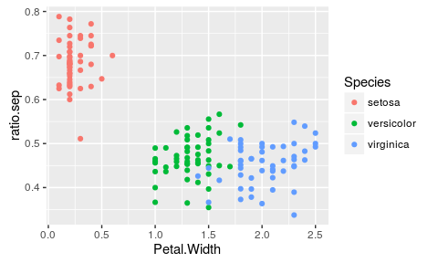

# Data Wrangling
Noah Simon and Ali Shojaie  
  


## Load the iris dataset


```r
data(iris)
colnames(iris)
```

```
## [1] "Sepal.Length" "Sepal.Width"  "Petal.Length" "Petal.Width" 
## [5] "Species"
```

```r
head(iris)
```

```
##   Sepal.Length Sepal.Width Petal.Length Petal.Width Species
## 1          5.1         3.5          1.4         0.2  setosa
## 2          4.9         3.0          1.4         0.2  setosa
## 3          4.7         3.2          1.3         0.2  setosa
## 4          4.6         3.1          1.5         0.2  setosa
## 5          5.0         3.6          1.4         0.2  setosa
## 6          5.4         3.9          1.7         0.4  setosa
```

## Access the columns and rows

The `i`th entry in column `j` can be accessed using `[i,j]`


```r
iris[3,2]    ### third entry in the second column
```

```
## [1] 3.2
```

Columns can also be accessed by name


```r
head(iris$Sepal.Width)
```

```
## [1] 3.5 3.0 3.2 3.1 3.6 3.9
```

and indexed by entry as before


```r
iris$Sepal.Width[3]
```

```
## [1] 3.2
```

## Access items by a vector of indicies

In addition, rather than just putting a single integer in `[]` 
(as in `iris$Sepal.Width[3]`), one can put a vector of indices in! 
Something like `iris$Sepal.Width[my_index_vector]`. Let's try this:


```r
my_inds <- c(1,3,4)
iris$Sepal.Width[my_inds]
```

```
## [1] 3.5 3.2 3.1
```

```r
iris$Sepal.Width[c(1,2,5)]
```

```
## [1] 3.5 3.0 3.6
```

```r
iris$Sepal.Width[1:3]
```

```
## [1] 3.5 3.0 3.2
```

## Access columns by name or number

Columns/variables can be accessed by number (Rather than by name):


```r
head(iris$Sepal.Width)
```

```
## [1] 3.5 3.0 3.2 3.1 3.6 3.9
```

```r
head(iris[,2])         ## Sepal.Width is second column
```

```
## [1] 3.5 3.0 3.2 3.1 3.6 3.9
```

An empty index (as above) means "give all the entries", so `iris[,2]` returns 
all of the entries in column `2` of the `iris` dataframe.

## Manipulating Data with Base (aka Basic) `R`

There are two important commands we will go over: `which` and `by` (and others 
that we will not: eg. `apply`, `match`, `sort`, `order`, `max`, `which.max`).

The more important of these is `which`.

## `which()`

`which` takes in a vector with `0` and `1` entries (or `true` and `false`) and 
returns a vector with the indices of the `1` or `true` entries\


```r
TF <- iris$Species == "versicolor"
head(TF)
```

```
## [1] FALSE FALSE FALSE FALSE FALSE FALSE
```

```r
head(which(TF))
```

```
## [1] 51 52 53 54 55 56
```

## `which()`


```r
head(iris[which(TF),])
```

```
##    Sepal.Length Sepal.Width Petal.Length Petal.Width    Species
## 51          7.0         3.2          4.7         1.4 versicolor
## 52          6.4         3.2          4.5         1.5 versicolor
## 53          6.9         3.1          4.9         1.5 versicolor
## 54          5.5         2.3          4.0         1.3 versicolor
## 55          6.5         2.8          4.6         1.5 versicolor
## 56          5.7         2.8          4.5         1.3 versicolor
```

## Summarizing subsets

We can string commands together and use this to summarize subsets of our data


```r
mean(iris$Sepal.Width[which(iris$Species == "versicolor")])
```

```
## [1] 2.77
```

```r
short_sepal_ind <- which(iris$Sepal.Length < median(iris$Sepal.Length))
mean(iris$Sepal.Width[short_sepal_ind])
```

```
## [1] 3.157534
```

```r
short_sepal_versa_ind <- which((iris$Sepal.Length < median(iris$Sepal.Length)) &
		      	       (iris$Species == "versicolor"))
mean(iris$Sepal.Width[short_sepal_versa_ind])
```

```
## [1] 2.633333
```

## Summarizing with `by()`

Rather than just summarizing for a single ``Species`` we may want to know mean 
``Petal.Length`` for each species. ``by`` comes in handy here: It applies a 
summarizing function to subsets of our data defined by an index (or key):


```r
by(iris$Sepal.Width, INDICES = iris$Species, FUN=mean)
```

```
## iris$Species: setosa
## [1] 3.428
## -------------------------------------------------------- 
## iris$Species: versicolor
## [1] 2.77
## -------------------------------------------------------- 
## iris$Species: virginica
## [1] 2.974
```

With enough typing, one can generally use these to do whatever one wishes.

## A Better Way!

What I showed before generally ends up requiring a lot of code that is usually 
overly clever, and hard to read/manage.

A cleaner, easier way to do this: Use two packages written by Hadley Wickham, 
`tidyr` and `dplyr`.

## The `dplyr` package

We will cover `dplyr` here. The 7 `dplyr` commands are:

- `select()`
- `filter()`
- `summarise()`
- `group_by()`
- `arrange()`
- `join()`
- `mutate()`

In addition there is a new operator `%>%` (piping operator) which is an 
easier-to-read way to combine functions.


```r
suppressMessages(library(dplyr))
```

## `select()`

`select` takes a dataframe, and grabs only some of the columns/features.


```r
head(select(iris, Sepal.Width, Species))
```

```
##   Sepal.Width Species
## 1         3.5  setosa
## 2         3.0  setosa
## 3         3.2  setosa
## 4         3.1  setosa
## 5         3.6  setosa
## 6         3.9  setosa
```

```r
head( iris %>% select(Sepal.Width, Species) )
```

```
##   Sepal.Width Species
## 1         3.5  setosa
## 2         3.0  setosa
## 3         3.2  setosa
## 4         3.1  setosa
## 5         3.6  setosa
## 6         3.9  setosa
```

## `select()` with `%>%` "pipe"


```r
iris %>% select(Sepal.Width, Species) %>% head()
```

```
##   Sepal.Width Species
## 1         3.5  setosa
## 2         3.0  setosa
## 3         3.2  setosa
## 4         3.1  setosa
## 5         3.6  setosa
## 6         3.9  setosa
```

Notice our use of the piping operator `%>%` (indicating that we "pipe" the 
`iris` data into the `select` function).

## `filter()`

`filter` subsets rows of a dataframe by true/false vectors


```r
head( filter( select(iris, Sepal.Width, Species), Species == "versicolor" ))
```

```
##   Sepal.Width    Species
## 1         3.2 versicolor
## 2         3.2 versicolor
## 3         3.1 versicolor
## 4         2.3 versicolor
## 5         2.8 versicolor
## 6         2.8 versicolor
```

## `filter()` with `%>%`


```r
iris %>%
    select(Sepal.Width, Species) %>%
    filter(Species == "versicolor") %>% 
    head()
```

```
##   Sepal.Width    Species
## 1         3.2 versicolor
## 2         3.2 versicolor
## 3         3.1 versicolor
## 4         2.3 versicolor
## 5         2.8 versicolor
## 6         2.8 versicolor
```

This is basically what we did using `which` in base-R

## `summarise()`

`summarise` calculates a summary statistic on our manipulated data


```r
iris %>%
     select(Sepal.Width, Species) %>%
     filter(Species == "versicolor") %>%
     summarise(mean.sepal.width = mean(Sepal.Width))
```

```
##   mean.sepal.width
## 1             2.77
```

## `group_by()`

`group_by` groups our observations by a categorical variable (the first step of 
a `by`)


```r
iris %>%
     select(Sepal.Width, Species) %>%
     group_by(Species) %>%
     summarise(mean.sepal.width = mean(Sepal.Width))
```

```
## Source: local data frame [3 x 2]
## 
##      Species mean.sepal.width
##       (fctr)            (dbl)
## 1     setosa            3.428
## 2 versicolor            2.770
## 3  virginica            2.974
```

This is a cleaner version of our `by` example from earlier.

## `arrange()`

`arrange` orders our data by one of the features


```r
head(iris %>%
          select(Sepal.Width, Species) %>%
          arrange(Sepal.Width))
```

```
##   Sepal.Width    Species
## 1         2.0 versicolor
## 2         2.2 versicolor
## 3         2.2 versicolor
## 4         2.2  virginica
## 5         2.3     setosa
## 6         2.3 versicolor
```

## `arrange()`

This can be combined with previous commands:


```r
iris %>%
    select(Sepal.Width, Species) %>%
    group_by(Species) %>%
    arrange(Sepal.Width) %>%
    head()
```

```
## Source: local data frame [6 x 2]
## Groups: Species [1]
## 
##   Sepal.Width Species
##         (dbl)  (fctr)
## 1         2.3  setosa
## 2         2.9  setosa
## 3         3.0  setosa
## 4         3.0  setosa
## 5         3.0  setosa
## 6         3.0  setosa
```

## `arrange()` and `summarize()`

... and can even used on summaries.


```r
iris %>%
     group_by(Species) %>%
     summarize(mean.sep.wid = mean(Sepal.Width),
               mean.sep.len = mean(Sepal.Length)) %>%
     arrange(mean.sep.wid)
```

```
## Source: local data frame [3 x 3]
## 
##      Species mean.sep.wid mean.sep.len
##       (fctr)        (dbl)        (dbl)
## 1 versicolor        2.770        5.936
## 2  virginica        2.974        6.588
## 3     setosa        3.428        5.006
```

## `join()`

Imagine we are analyzing patient information and have two datasets. Both 
datasets are on the same patients; one has clinical information on the patients, 
and another has lab information. `join()` allows us to combine these two 
datasets into one (even if patients are in different orders, so long as they 
have a unique identifier).

`join()` is particularly neat because it has options that allow it to flexibly 
work even if some patients don't have clinical information and others don't 
have lab information.

## `mutate()`

`mutate` adds new features to our data. For example, we might want to work with 
the ratio of width-to-length:


```r
iris %>% mutate(ratio.sep = Sepal.Width/Sepal.Length) %>% head()
```

```
##   Sepal.Length Sepal.Width Petal.Length Petal.Width Species ratio.sep
## 1          5.1         3.5          1.4         0.2  setosa 0.6862745
## 2          4.9         3.0          1.4         0.2  setosa 0.6122449
## 3          4.7         3.2          1.3         0.2  setosa 0.6808511
## 4          4.6         3.1          1.5         0.2  setosa 0.6739130
## 5          5.0         3.6          1.4         0.2  setosa 0.7200000
## 6          5.4         3.9          1.7         0.4  setosa 0.7222222
```

## `mutate()`


```r
iris %>%
     mutate(ratio.sep = Sepal.Width/Sepal.Length,
            ratio.pet = Petal.Width/Petal.Length,
            ratio.diff = ratio.sep - ratio.pet) %>%
     group_by(Species) %>%
     summarize(mean.sep.ratio = mean(ratio.sep),
               mean.pet.ratio = mean(ratio.pet),
               mean.ratio.diff = mean(ratio.diff))
```

```
## Source: local data frame [3 x 4]
## 
##      Species mean.sep.ratio mean.pet.ratio mean.ratio.diff
##       (fctr)          (dbl)          (dbl)           (dbl)
## 1     setosa      0.6842483      0.1678683      0.51638002
## 2 versicolor      0.4676804      0.3111062      0.15657417
## 3  virginica      0.4533956      0.3667386      0.08665706
```

## Some questions for you to work on!

- How many flowers are there of each `Species`?
- How many flowers are there with `Sepal.Width` greater than the overall mean?
- Of the flowers with `Sepal.Width` greater than the overall mean, how many 
belong to each `Species`?
- For each `Species`, what is the mean `Petal.Length` for those flowers with 
`Sepal.Length` greater than the median `Sepal.Length` within their species?
- Is the ratio of `Sepal.Length/Sepal.Width` different for flowers with 
`Petal.Length` greater than the median vs those with `Petal.Length` less than 
the median? Is this different for different species?
- If you are particularly precocious, then you can answer the above graphically 
by piping your output into `ggplot2`

## `%>%` into `ggplot2`

We can take our output and pipe directly into Hadley Wickham's plotting 
environment `ggplot2`.


```r
library(ggplot2)
```


```r
iris %>% mutate(ratio.sep = Sepal.Width/Sepal.Length) %>%
         ggplot(., aes(x=Petal.Width, y=ratio.sep, color=Species)) + geom_point()
```

\


## Another Dataset to play with


```r
url <- "http://faculty.washington.edu/nrsimon/datasets/salary.txt"
salary_dat <- read.table(url)
names(salary_dat)
```

```
##  [1] "V1"  "V2"  "V3"  "V4"  "V5"  "V6"  "V7"  "V8"  "V9"  "V10" "V11"
```

oops!

## Another Dataset to play with


```r
salary_dat <- read.table(url, header = TRUE)
names(salary_dat)
```

```
##  [1] "case"    "id"      "gender"  "deg"     "yrdeg"   "field"   "startyr"
##  [8] "year"    "rank"    "admin"   "salary"
```

This data contains salary, rank, and gender information on faculty members in 
various fields at various times. Many faculty members have multiple entries in 
this data (`id` refers to the faculty member)

- Create a dataframe that has a single entry for each `id` which contains the 
`gender` the maximum `salary` for that `id`, and the `rank` at the time of 
that `salary` entry.
- Compare the average `maximum salary` between `male` and `female` professors
- Break this comparison down by `rank`
- Find the `id` of the female professor with the 10th smallest `maximum salary` 
among all female professors
