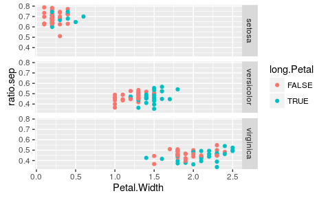

# Data Wrangling Solutions
Noah Simon and Ali Shojaie  
  


## Load data and libraries


```r
data(iris)
suppressMessages(library(dplyr))
library(ggplot2)
```

## How many flowers?

- How many flowers are there of each `Species`?


```r
iris %>%
     group_by(Species) %>%
     summarize(num = length(Sepal.Width))
```

```
## Source: local data frame [3 x 2]
## 
##      Species   num
##       (fctr) (int)
## 1     setosa    50
## 2 versicolor    50
## 3  virginica    50
```

## How many flowers?

- How many flowers are there of each `Species`?


```r
iris %>%
     group_by(Species) %>%
     summarize(num = n())
```

```
## Source: local data frame [3 x 2]
## 
##      Species   num
##       (fctr) (int)
## 1     setosa    50
## 2 versicolor    50
## 3  virginica    50
```

## How many flowers? - `by()`

- How many flowers are there of each `Species`?


```r
by(iris$Species, iris$Species, length)
```

```
## iris$Species: setosa
## [1] 50
## -------------------------------------------------------- 
## iris$Species: versicolor
## [1] 50
## -------------------------------------------------------- 
## iris$Species: virginica
## [1] 50
```

## How many flowers?

- How many flowers are there with `Sepal.Width` greater than the overall mean?


```r
iris %>%
     filter(Sepal.Width > mean(Sepal.Width)) %>%
     summarize(num = n())
```

```
##   num
## 1  67
```

```r
iris %>%
     summarize(num = sum(Sepal.Width > mean(Sepal.Width)))
```

```
##   num
## 1  67
```

```r
sum(iris$Sepal.Width > mean(iris$Sepal.Width))
```

```
## [1] 67
```

## How many flowers?

- Of the flowers with `Sepal.Width` greater than the overall mean, how many 
belong to each `Species`?


```r
iris %>%
     filter(Sepal.Width > mean(Sepal.Width)) %>%
     group_by(Species) %>%
     summarize(num = n())
```

```
## Source: local data frame [3 x 2]
## 
##      Species   num
##       (fctr) (int)
## 1     setosa    42
## 2 versicolor     8
## 3  virginica    17
```

## How many flowers?

- Of the flowers with `Sepal.Width` greater than the overall mean, how many 
belong to each `Species`?


```r
ind <- which(iris$Sepal.Width > mean(iris$Sepal.Width))
by(iris$Species[ind], iris$Species[ind], length)
```

```
## iris$Species[ind]: setosa
## [1] 42
## -------------------------------------------------------- 
## iris$Species[ind]: versicolor
## [1] 8
## -------------------------------------------------------- 
## iris$Species[ind]: virginica
## [1] 17
```

## Mean petal length

- For each `Species`, what is the mean `Petal.Length` for those flowers with 
`Sepal.Length` greater than the median `Sepal.Length` within their species?


```r
iris %>%
     group_by(Species) %>%
     filter(Sepal.Length > median(Sepal.Length)) %>%
     summarize(mean.petal.length = mean(Petal.Length))
```

```
## Source: local data frame [3 x 2]
## 
##      Species mean.petal.length
##       (fctr)             (dbl)
## 1     setosa          1.509091
## 2 versicolor          4.575000
## 3  virginica          5.963636
```

## Mean petal length

- For each `Species`, what is the mean `Petal.Length` for those flowers with 
`Sepal.Length` greater than the median `Sepal.Length` within their species?


```r
subset.mean <- function(x){
  ind <- x$Sepal.Length > median(x$Sepal.Length)
  return(mean(x$Petal.Length[ind]))
  }

by(iris[,c("Sepal.Length", "Petal.Length")], iris$Species, subset.mean)
```

```
## iris$Species: setosa
## [1] 1.509091
## -------------------------------------------------------- 
## iris$Species: versicolor
## [1] 4.575
## -------------------------------------------------------- 
## iris$Species: virginica
## [1] 5.963636
```

## Ratio of sepal length to sepal width

- Is the ratio of `Sepal.Length/Sepal.Width` different for flowers with 
`Petal.Length` greater than the median vs those with `Petal.Length` less than 
the median? Is this different for different species?


```r
iris %>%
     mutate(ratio.sep = Sepal.Width/Sepal.Length,
            long.Petal = Petal.Length > median(Petal.Length)) %>%
     group_by(long.Petal) %>%
     summarize(mean.ratio = mean(ratio.sep))
```

```
## Source: local data frame [2 x 2]
## 
##   long.Petal mean.ratio
##        (lgl)      (dbl)
## 1      FALSE  0.6122137
## 2       TRUE  0.4580025
```

## Ratio of sepal length to sepal width

- Is the ratio of `Sepal.Length/Sepal.Width` different for flowers with 
`Petal.Length` greater than the median vs those with `Petal.Length` less than 
the median? Is this different for different species?


```r
iris %>%
     group_by(Species) %>%
     mutate(ratio.sep = Sepal.Width/Sepal.Length,
            long.Petal = Petal.Length > median(Petal.Length)) %>%
     group_by(Species, long.Petal) %>%
     summarize(mean.ratio = mean(ratio.sep))
```

```
## Source: local data frame [6 x 3]
## Groups: Species [?]
## 
##      Species long.Petal mean.ratio
##       (fctr)      (lgl)      (dbl)
## 1     setosa      FALSE  0.6846836
## 2     setosa       TRUE  0.6830096
## 3 versicolor      FALSE  0.4681444
## 4 versicolor       TRUE  0.4672163
## 5  virginica      FALSE  0.4643401
## 6  virginica       TRUE  0.4424512
```

## Ratio of sepal length to sepal width

- If you are particularly precocious, then you can answer the above graphically 
by piping your output into `ggplot2`


```r
iris %>%
     group_by(Species) %>%
     mutate(ratio.sep = Sepal.Width/Sepal.Length,
            long.Petal = Petal.Length > median(Petal.Length)) %>%
     ggplot(., aes(x=Petal.Width, y=ratio.sep, color=long.Petal)) + 
    geom_point() + facet_grid(Species~.)
```

\


## Another Dataset to play with


```r
url <- "http://faculty.washington.edu/nrsimon/datasets/salary.txt"
salary_dat <- read.table(url, header = TRUE)
names(salary_dat)
```

```
##  [1] "case"    "id"      "gender"  "deg"     "yrdeg"   "field"   "startyr"
##  [8] "year"    "rank"    "admin"   "salary"
```

- Create a dataframe that has a single entry for each `id` which contains the 
`gender` the maximum `salary` for that `id`, and the `rank` at the time of that 
`salary` entry.


```r
new_dat_frame <- as.data.frame(salary_dat %>%
			     		  select(id, gender, salary, rank) %>%
	      	 	     		  group_by(id) %>%
			     		  filter(salary == max(salary)))
```

## Compare salaries by gender

- Compare the average `maximum salary` between `male` and `female` professors


```r
salary_dat %>%
	   select(id, gender, salary, rank) %>%
	   group_by(id) %>%
	   filter(salary == max(salary)) %>%
	   group_by(gender) %>%
	   summarise(mean.max.salary = mean(salary))
```

```
## Source: local data frame [2 x 2]
## 
##   gender mean.max.salary
##   (fctr)           (dbl)
## 1      F        5385.321
## 2      M        6701.520
```

## Compare salaries by gender and rank

- Break this comparison down by `rank`


```r
salary_dat %>%
	   select(id, gender, salary, rank) %>%
	   group_by(id) %>%
	   filter(salary == max(salary)) %>%
	   group_by(gender, rank) %>%
	   summarise(mean.max.salary = mean(salary))
```

```
## Source: local data frame [6 x 3]
## Groups: gender [?]
## 
##   gender   rank mean.max.salary
##   (fctr) (fctr)           (dbl)
## 1      F Assist        4482.100
## 2      F  Assoc        5025.432
## 3      F   Full        6883.722
## 4      M Assist        4735.422
## 5      M  Assoc        5404.599
## 6      M   Full        7707.461
```

## Tenth smallest maximum salary

- Find the `id` of the female professor with the 10th smallest `maximum salary` 
among all female professors


```r
salary_dat %>%
	   select(id, gender, salary, rank) %>%
	   filter(gender == "F") %>%
	   group_by(id) %>%
	   summarise(max.salary = max(salary)) %>%
	   arrange(max.salary) %>%
	   summarise(id[10])
```

```
## Source: local data frame [1 x 1]
## 
##   id[10]
##    (int)
## 1   1032
```
