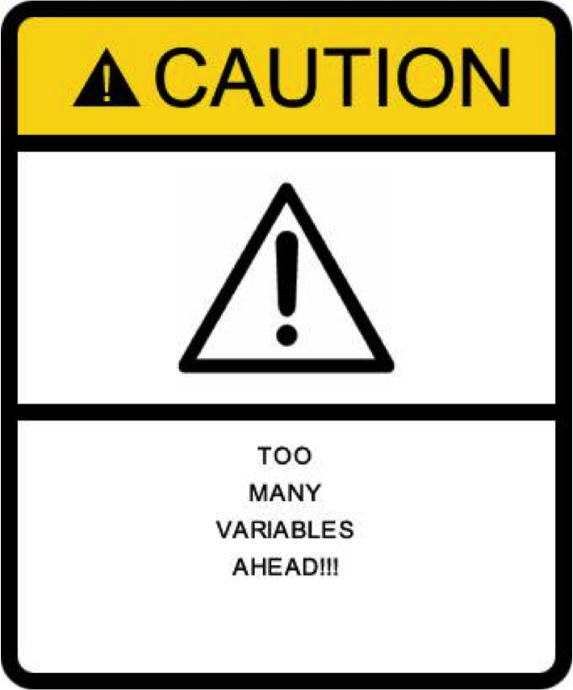

```{r set_knitr_options, echo=FALSE, message=FALSE}
suppressMessages(library(knitr))
opts_chunk$set(tidy=FALSE, cache=TRUE, echo=TRUE, message=FALSE)
```

```{r setup, include=FALSE, echo=FALSE}
opts_chunk$set(dev = 'pdf')

mysummary <- function(obj) {
  res <- capture.output(summary(obj))
  res <- res[nchar(res)>0]                  # remove newlines
  res <- res[-(grep("^Residuals:", res):grep("^Coef", res))]  # remove Residuals-Coefficients area
  res <- c(res, "\n")                       # end on a newline
  cat(paste(res, collapse="\n"))
}

predict.regsubsets=function(object,newdata,id,...){
  form=as.formula(object$call[[2]])
  mat=model.matrix(form,newdata)
  coefi=coef(object,id=id)
  xvars=names(coefi)
  mat[,xvars]%*%coefi
}
```

<!--
## Agenda 

- Overview of Machine Learning (ML)
- Application of ML in biology
- A closer look into some ML tools
- Dangers and cautions
- Practice with ...
- New directions in ML (aka buzz words!)

-->

## What is Machine Learning? {.build}


## What is Machine Learning? {.build}


## What is Statistical Machine Learning? {.build}

Combining **data** and **analytical tools** to understand [biological] systems

Two types: **Supervised** and **Unsupervised**

__Supervised__: Looking at the relationship between **features** and a
specified **response** 

- (eg. regression, 2-sample tests) 

__Unsupervised__: **No response** ??? looking for structure between
features. 

- (eg. clustering, dimension reduction, network analysis)


## A Simple Example {.build}

Suppose we have $n = 400$ people with diabetes for whom we have $p = 3$ serum-level measurements (_LDL_, _HDL_, _GLU_).
  
We wish to predict these peoples' disease progression after 1 year. 
(**Supervised**)


## A Simple Example

<div class="columns-2">


<br>
<br>

Notation:

  - $n$ is the number of observations.
  - $p$ the number of variables/features/predictors.
  - $y$ is a $n$-vector containing response/outcome for each of $n$ observations.
  - $X$ is a $n\times p$ data matrix.

</div>

## Linear Regression on a Simple Example
  
You can perform linear regression to develop a model to predict progression using _LDL_, _HDL_, and _GLU_:
\[
y = \beta_0 + \beta_1 X_1 + \beta_2 X_2 + \beta_3 X_3 + \varepsilon
\]
where $y$ is our continuous measure of disease progression, $X_1$, $X_2$, $X_3$ are our serum-level measurements, and $\varepsilon$ is a __noise__ term.


## A Relationship Between the Variables?

<div class="centered">

</div>


## Supervised Learning {.build}

On each of $n$ patients measure 

$y_i$ --- an outcome

- (e.g. survival time/status, PCR)

$x_i$ --- $p$-vector of features

- (e.g. SNPs, gene expression, environmental exposure, etc)

**Supervised** learning connects $X$ to $y$

The canonical **supervised** problem is to build a **model** connecting **features to outcome**


## Supervised Learning {.build}

The **type** of model depends on the type of outcome:

_Continuous_: Linear Regression

- (e.g. % tumor shrinkage)

_Binary_: Logistic Regression

- (e.g. PCR, tumor-shrinkage-yes/no)

_Survival_: Cox Regression

- (e.g. PFS-time, OS-time)

One can also do fancier things---and we'll talk about some of these ideas---but the basic idea is the same!

<!-- But generally these (+ simple extensions) are enough -->


## Regression-based Learning  {.buld}

These all _model outcome as a simple function of the features_:

**Linear**
\[
  y = \beta_0 + \beta_1\,feature_1 + \cdots + \beta_p\,feature_p + \varepsilon
\]

**Logistic** 
\[
  Prob(y = 1) = e^{[\ldots]}/(1 + e^{[\ldots]}) 
\]

**Cox**
\[
  Prob(\text{Failing at time } t) \propto e^{[\ldots]}
\]


## Regression-based Learning {.buld}

Given Data/observations (outcome-feature pairs) 

- Estimate $\beta_0, \beta_1,\ldots,\beta_p$.

- Estimates are generally given with "hats": 
$\hat\beta_0, \hat\beta_1,\ldots,\hat\beta_p$. 

- Classically, estimates are chosen to "best fit" the data (e.g. line-of-best-fit/ least squares)

<div class="centered">

</div>

<!-- 

## What do we do with these models?

<div class="centered">

</div>

 -->

## What do we do with these models?  {.buld}

After "fitting" the model to the data, we end up with an "_estimated model_"

For linear/logistic reg this can be used for **prediction**:
  
  - Are people living in larger cities more likely to have higher blood pressure?
  - Do children of farm-workers have a higher risk of chronic bronchitis?

Fancier (and non-model-based or algorithmic) methods also give **predictions**...(more about this later)

<div class="centered">

</div>


## What do we do with these models?  {.buld}

We can also use the model to calculate a score: 
\[
  score_i = \hat\beta_0 + \hat\beta_1 \, feature_{1,i} + \cdots + \hat\beta_p \, feature_{p,i}
\]
to e.g. **stratify patients** as high/med/low risk (for instance, for survival)

<div class="centered">

</div>


## What do we do with these models?  {.buld}

In addition to prediction/stratification, models are also used for **testing conditional/adjusted association**:

Is $feature_j$ associated with outcome $y$ after adjusting for other features?

 - To do this, you test if $\beta_j = 0$ (using $\hat\beta_j$) 
 - In "classical" settings, software will generally do this for you


## Wait, isn't this what we always do?!  {.buld}

Yes and No!

The principles are the same, but the data we are dealing with is very different.

- In classical, **low-dimensional problems**: $n \gg p$

- Lots of BIG data sets coming out of modern biological techniques are **high-dimensional**: $n \approx p$ or $n \ll p$   

- Remember: ML = combining **data** and **analytical tools**

- The new **Big Data** pose **new challenges** for statistical analysis!


## Gene Expression Data

<div class="centered">

</div>

## DNA Sequence Data

<div class="centered">

</div>

## DNAse Hypersensitivity Data

<div class="centered">

</div>

## Metabolomics Data

<div class="centered">

</div>


## Low-Dimensional 

<div class="centered">

</div>


## High-Dimensional 

<div class="centered">

</div>


## Analysis of High-Dimensional Data {.buld}

For most biomedical big data analyses, we have many more variables than observations... i.e. $p \gg n$

  - Predict risk of diabetes on the basis of DNA sequence data.... using $n = 1000$ patients and $p = 3000000$ variables 
  - Identify genes whose expression is associated with survival time... using $n = 250$ cancer patients and $p = 20000$ variables 


## Dangers!! {.bulid}

With these data, we run a high risk of fitting **models that look great on our data**...

But **perform terribly on future data/in the clinic**

Even very simple tasks, like identifying variables that are associated with a response, must be done with care

<div class="centered">

</div>


## The Diabetes Data

```{r df1}
library(lars)

data(diabetes)
attach(diabetes)
# ?diabetes
dim(x)
colnames(x)
```


## The Diabetes Data

Let's look at the associations of different variables with y (only numerical variables)

```{r plot1, fig.height=4, fig.width=8}
attach(diabetes)
par(mfrow=c(2,4), mar=c(4,4,1,1))
for(i in 3:ncol(x)) plot(x[,i], y, xlab=colnames(x)[i])
```


## The Diabetes Data

Let's take a "training" subset of the diabetes data

```{r dat1}
attach(diabetes)

set.seed(1)
ind <- sample(1:nrow(x), 2*nrow(x)/3)
x.trn <- x[ind,]
y.trn <- y[ind]

x.tst <- x[-ind,]
y.tst <- y[-ind]
```


## The Diabetes Data

Simple linear regression of $y$ on $bmi$

```{r simple reg1, fig.align='center', fig.height=3, fig.width=4}
bmi.trn <- x.trn[,3]
bmi.tst <- x.tst[,3]

library(ggplot2)
qplot(bmi.trn, y.trn) + geom_smooth(method=lm)
```


## The Diabetes Data

Simple linear regression of $y$ on $bmi$

```{r simple reg2}
fit <- lm(y.trn ~ bmi.trn)
mysummary(fit)
```

- Not a very good $R^2$!


## The Diabetes Data

What is the error of this model?

```{r}
yhat <- predict(fit)
mean((y.trn-yhat)^2)   # MSE-train
```

How well can we predict the outcome of **new patients**?

  - this is why we separated the data into *training* and *test* samples

```{r}
yhat <- coef(fit)[1] + coef(fit)[2] * bmi.tst
mean((y.tst-yhat)^2)   # MSE-test
```


## The Diabetes Data

Perhaps our model is **too simple**

  - can we get improve the prediction by including the other variables?

## The Diabetes Data

```{r multiple reg1}
fit <- lm(y.trn ~ x.trn)
mysummary(fit)
```

- Much better $R^2$!!

## The Diabetes Data

What is the error of this model?

```{r}
yhat <- predict(fit)
mean((y.trn-yhat)^2)   # MSE-train
```

Smaller training error...

How well does this model predict?

```{r}
yhat <- coef(fit)[1] + x.tst %*% matrix(coef(fit)[-1],ncol=1)
mean((y.tst-yhat)^2)   # MSE-test
```

Smaller **test error**, too


## The Diabetes Data

What about a more complex model?

The x2 data set includes (important) interaction terms among features and a total of `r ncol(diabetes$x2)` variables

```{r highd reg}
x2.trn <- diabetes$x2[ind,]
x2.tst <- diabetes$x2[-ind,]

fit <- lm(y.trn ~ x2.trn)
```

What is the error of this model?
```{r}
yhat <- predict(fit)
mean((y.trn-yhat)^2)   # MSE-train
```
Even smaller **training error**...


## The Diabetes Data

How well does this model predict?
```{r}
yhat <- coef(fit)[1] + x2.tst %*% matrix(coef(fit)[-1],ncol=1)
mean((y.tst-yhat)^2)   # MSE-test
```
Hmm...the **test error** became *much* larger!!


## Dangers!! {.build}

Classical model-fitting works looks at *how well the model fits the data*

Not particularly interested in **_Training Error_**:

 - Performance of the model on **original (training) data**

Interested in **_Test Error_** (aka **_Generalization Error_**):

  - Performance of the model on **future (unseen) data**

</br>

*Models always look better on data used for training*!

  - Improved Training performance $\not\rightarrow$ Better Test Error

</br>

**Test Error** determines **_reproducibility_**/**_generalizability_** of the model/results!


## Dangers!! {.build}

**Training Error** vs **Test Error**

**Increasing complexity** of model always *improves training error*:

  - Adding features
  - Adding complex interactions 
  - Allowing complicated nonlinear fits

**Increasing complexity** often *hurts test error*; when complexity doesn???t capture strong signal

  - Not enough data to support degree of complexity


## Dangers!! {.build}

<div class="centered">

</div>


## Dangers!! {.build}

When the model is too complex/adaptive/flexible

  - (i.e. Training Performance $>>$ Test Performance)
  
We say that we are **overfitting**

  - (i.e. fit to noise rather than just signal)


## Dangers!! {.build}

<div class="centered">

</div>

</br>

To protect against overfitting...

  - we need to estimate the **test error** 
  - use that to **control the model complexity**

## How to protect against over-fitting? {.buld}

Can't using just the training data...add **validation data**!

  - Split the **training data** into *training* and *validation* sets
  - *Fit the model on training set*, and **evaluate on validation set**

<div class="centered">

</div>


## How to protect against over-fitting? {.buld}

Can't we just use the **test data** to check how our model perform?
  
  - Unfortunately, **_NO_**!
  - The problem is that if you look at **multiple models** and check how they perform on the **test data**, then your *test data is used in the model fitting process*!!
  - Then your prediction performance would be artificially good and **not reproducible**

So, we need **three** data sets
  
  - **training set**: this is what we use to fit our model
  - **validation set**: this is what we use to evaluate our model---it's OK to peek into this data to check how our models are doing!
  - **test set**: this is what we **_don't touch_**! Basically, we pretend that we don't even have access to this data and it's **locked out** (ideally, this is how it should be done!)

Fancier version of this strategy exists and are called **Cross-Validation** 
  
  - They allow *more efficient use of data*


## How to control the model complexity?

So, we discussed how to *estimate the generalization error*

But, how can we *control the model complexity*?

  - A large (and growing) literature on model complexity and model selection within machine learning and statistics
  - We will discuss a few basic ideas here...but again, there's much more out there!
  
## How to control the model complexity?

Let's look at the *diabetes* data again, but this time 
  - we first create a *data.frame* to make things simpler
  - we further *split our training data* into **training** and **validation**

```{r modsel 1}
attach(diabetes)
dat <- data.frame(cbind(x,y))

set.seed(2)
ind <- sample(1:3, nrow(dat), replace=TRUE, prob=rep(1/3,3))
table(ind)
dat.trn <- dat[(ind==1),]
dat.vld <- dat[(ind==2),]
dat.tst <- dat[(ind==3),]

fit <- lm(y~., data=dat.trn)
```

## How to control the model complexity?
```{r modsel 2}
mysummary(fit)
```
So, not all the variables are equally *associated* with $y$


## How to control the model complexity?

Intuitively, variables that are more strongly associated with $y$ should give us better prediction

And, we *can* now look at the **validation error** to assess this

Let see what happens if we take the subset of *significant* variables...
```{r modsel 3}
yhat <- predict(fit, newdata=dat.vld)
( MSE.1 <- mean((dat.vld$y - yhat)^2) ) #MSE-validation

fit <- lm(y~sex+bmi+map, data=dat.trn)

yhat <- predict(fit, newdata=dat.vld)
( MSE.2 <- mean((dat.vld$y - yhat)^2) ) #MSE-validation
```
Hmm, looks like this doesn't work!


## How to control the model complexity?

The problem with the previous strategy is that it's *ad hoc*: 
there is **no guarantee that the subset of significant variables gives the best prediction error**!!

Instead, what we really want is to **find the best subset of variables that gives the best prediction**


## How to control the model complexity?

To find the **best** model for prediction, we can *search over all possible subsets of variables*
  - we can do this using the *leaps* package 

```{r modsel 4}
library(leaps)
p <- ncol(dat)-1
fit <- regsubsets(y~., data=dat.trn)
summary(fit)$outmat
```

## How to control the model complexity?

Which one of the above 8 models gives the best prediction?

  - We can answer this using our **validation data**

```{r modsel 5, fig.align='center', fig.height=3, fig.width=4}
vld.err <- numeric(8)
for (i in 1:8) {
    yhat <- predict(fit, newdata=dat.vld, id=i)
    vld.err[i] <- mean((dat.vld$y - yhat)^2)
}
par(mar=c(4.5,4.5,0.1,0.1))
plot(vld.err, ylab="MSE", xlab="Model Size", ylim=c(2900,4000), pch=19, type="b")
```


## How to control the model complexity?

The above strategy is called **best subset selection** and we can use it to find the best possible model!

However, this strategy only works if we have a few variables

  - there are $2^p$ possible subsets for a model of size $p$
  - so, for the x2 data set, with $p=64$, we would need to search over `r 2^64` possible models
  - in fact the default option in *reg.subsets()* is to limit the maximum size of the subsets to 8 variables 

**Exercise**: using the *diabetes* data

- Redo the best subset selection for x
- Repeat the analysis for all `r p` variables in x


## Things that we won't talk about here

Methods for building models which:

  - automatically select important features
  - allow smooth/structured/fancy non-linear fits
  - inference in high dimensions (very new and hot topic)

Many other approaches:

  - Lasso, etc
  - Random Forests
  - Support Vector Machines
  - Neural Nets
  - Deep Learning
  - ...


## Unsupervised Learning {.build}

**Supervised** Learning relates $X$ to $y$

<div class="centered">

</div>


## Unsupervised Learning {.build}

**Unsupervised** Learning looks for connections only within $X$

<div class="centered">

</div>

- **clustering** (hierarchical clustering, k-means clustering, etc)
- **dimension reduction** (PCA, MDS, etc)
- **network analysis** (graphical models, etc)

## Now you know how "machines learn!" {.build}


\[
\,
\]

But if you want to learn more, you can take **BIOST 546** in spring!
