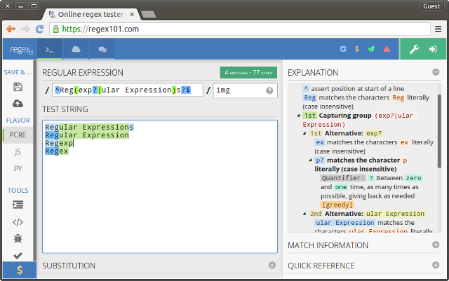
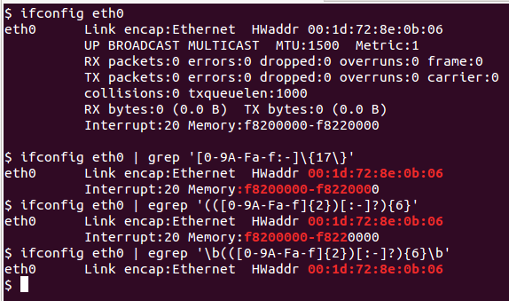
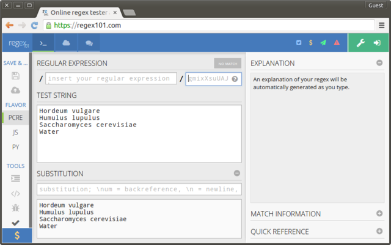

# Regular Expressions
[Brian High](https://github.com/brianhigh)  
  


## Regular Expressions

Ever need to search and replace text?

A powerful, flexible, nearly universal "wildcard" syntax is available to you. 

It is called, "Regular Expressions", among other names...

Regular expressions are "wildcard" search patterns that can be used to _match_
text and also to help _replace_ text. They use a special syntax which we will 
learn today.

Regular expressions are supported by applications such as MS-Word, Notepad++,
TextWrangler, jEdit, Gedit, and RStudio. They are also supported by programming
languages like Perl, Python, JavaScript, R, C#, and Bash.

## Regular Expressions Meta-Example

This expression:

```
/^Reg(exp?|ular Expression)s?$/i
```

Matches these lines:

```
Regular Expressions
Regular Expression
Regexp
Regex
```

These are all common names for today's topic.

## WTF?

Let's decode this: `/^Reg(exp?|ular Expression)s?$/i`


Symbol(s) | Meaning 
--------- | ------------- 
/stuff/   | The pattern sequence (stuff) is between slashes       
^         | Matches the beginning of the text (or line)  
Reg       | Matches the text string "Reg" (literally)
(stuff)   | Group stuff inside, and capture for later use
(a\|b)    | Matches "a" _or_ "b"
?         | Matches O or 1 of whatever is directly to the left
$         | Matches the end of the text (or line)
i         | Modifier to use "case insensitive mode"

## in english plz!

The expression:

```
/^Reg(exp?|ular Expression)s?$/i
```

Matches:

* A text string that starts with "Reg"
* Followed by "ex" or "exp" or "ular Expression"
* Followed by nothing, or maybe by an "s"
* With nothing else remaining in the string (or line)
* Regardless of the case of any of the letters (upper or lower).

So, it matches the common terms used for "Regular Expressions", like "regex".

## Pattern Modifiers

We used a pattern modifer `i` for "case insensitive". We will be using
some others today as well. We need them in order to control the usage modes
of our regular expressions.

```
/^Reg(exp?|ular Expression)s?$/img
```

Symbol(s) | Stands for | Meaning 
--------- | ---------- | ------- 
i         | insensitive| case _insensitive_
m         | multiline  | ^$ applies to lines _and_ strings
g         | global     | find _all_ matches in string


## Regular Expressions Tester: Regex101.com



## Character classes

Beyond simple literal matches, we can also match by "character classes".

A character class a list of one or more characters of a certain 
type that you want to match. It is represented by a special symbol or group
of symbols.

Symbol(s) | Meaning 
--------- | ------------- 
\\w       | word character - alphanumeric and underscore
\\t       | tab character
\\s       | space and other "whitespace" characters
\\r       | carriage-return (an end-of-line character)
\\n       | newline (an end-of-line character)
\\d       | digit
.         | any character except end-of-line characters

## Custom character classes

We can make our own classes, too. Here are some examples.

Symbol(s)      | Meaning 
-------------- | ------------- 
[A-Za-z]       | alphabet letters
[A-Z]          | upper-case alphabet letters
[a-z]          | lower-case alphabet letters
[0-9.-]        | digits, decimal (period), and dash (minus sign)
[0-9A-Fa-f]    | hexadecimal digits
[01]           | binary digits
[^aeiou]       | ^ as first item means "not one of these"

So, `(a|b)` is like to `[ab]`, meaning "a or b". `[a-b]` means "a to b".

## POSIX character classes

To make your expressions more readable, and to allow for more possible
pre-defined and standard classes, we also have POSIX classes.

| POSIX     |  Same as [ ]      | Description         |
|-----------|-------------------|---------------------| 
| [:alnum:] | [A-Za-z0-9]       | alphabet and digits |
| [:alpha:] | [A-Za-z]          | alphabet letters    |
| [:digit:] | [0-9]             | digit, zero to nine |
| [:lower:] | [a-z]             | lower case letter   |
| [:upper:] | [A-Z]             | upper case letter   |
| [:blank:] | [ \\t]            | space and tab       |
| [:space:] | [ \\t\\r\\n\\v\\f]| all whitespace      | 

Regex101.com does not support them, but R and many other languages do.

## Quantifiers: How many?

To specify _how many_ characters of a character class we want to match, we can
use these quanitifiers right after the class:

Symbol(s) | Meaning 
--------- | ------------- 
?         | 0 or 1 ("optionally one")
+         | 1 or more ("at least one", "some")
*         | 0, 1 or more ("optionally some")
{n}       | exactly n
{n,m}     | n to m
{n,}      | n or more
{,m}      | at most m

So, `X+` means one or more "X" and `(deer|elk)*` means 0, 1, or more 
"deer or elk".

## Greedy Quantifiers

The quantifiers `+` and `*` will try to match as many characters as they can.
Therefore, they are "greedy". Sometimes, you don't want this. 

Let's say we have a line of data like `GATTACAAGATTACAAAAAAA` in our dataset.

We want to match everything but the string of `AAAAAAA` at the very end, no 
matter how many `A`s there are, we might try the expression: `(\w+)A*`. 

Here is what this would match: `GATTACAAGATTACAAAAAAA`. That's too much. The
`+` was greedy and matched as much as it could, to the end of the string.

To make `+` non-greedy, we can place a `?` after it like this: `+?`.

But `(\w+)A*` matches only `GA`. If we use the `$` anchor, then we get the
match we want. Now `(\w+?)A*$` matches only `GATTACAAGATTAC`. 

Try this in Regex101.com and see for yourself.

Note: You may also use the `U` pattern modifier to turn off greediness.

## Backslashes

The backslash character \ is used to control special meaning. 

Preceding a ordinary character, like certain letters, with a backslash will 
give it a special meaning.

These characters become special when preceded by a backslash.

```
dswbDSWBntr
```

Capitalizing the letter may give it an opposite meaning.

`\D`, `\S`, `\W`, and `\B` mean the opposite of `\d`, `\s`, `\w`, and `\b`, 
respectively.

So, for example, `\d` (digit) and `[0-9]` mean the same thing and `\D` 
(non-digit) and `[^0-9]` mean the same thing.

## Escapes

When used to take away special meaning, the backslash is said to "escape" 
the character. This applies spefically to some of the punctuation symbols.

These symbols need to be escaped to make them literal:

```
{}[]()^$.|*+?\
```

That is, if you want to include one of these special symbols as a 
literal (ordinary) character, you may have to "escape" it with a backslash 
to take away its special meaning. Example: `Wh(o|at|ere|en|y)\?`

Escaping usually applies outside of character classes, `[]`, not within them. 
This is because the square bracket notation implies most punctuation symbols are
being used in their ordinary sense. There are exceptions to this (such as the
"[" and "]" characters, which need to be escaped if within a character class).

## Anchors

Anchors are very special because they do not match any characters.

For example, `^` and `$` tie a match to a location: `^` = start, `$` = end.

`\b` is an anchor for a "word-boundary" -- the beginning or ending of a word or 
a string like a word.

That is, a word-boundary is a zero-width boundary between a word-class
character (`\w`) and a non-word-class character (`\W`).

Why would you need that?

## Anchor example

Remember the `ifconfig` command that shows information about your network
interface? How to we match _just_ the Ethernet hardware address (HWaddr) in
the output from the `ifconfig` command? See the effect of `\b`?



## Um, what about...

Why not just add a space in front of the first expression and
just use: 

```
' [0-9A-Fa-f:-]{17}'
```

As in:

```
$ ifconfig eth0 | egrep ' [0-9A-Fa-f:-]{17}'
eth0      Link encap:Ethernet  HWaddr 00:1d:72:8e:0b:06
```

This expression would _sort of_ work. This shortcut does
not match _just_ the HWaddr, though. It _also_ matches the 
preceding space. In many situations, this difference would 
matter.

Try to make your expressions as precise as possible. Otherwise,
they can be the source of subtle "bugs", often hard to troubleshoot later.

## Find and Replace

Parentheses also let you "capture" groups of characters for replacement. Each 
group surrounded in parentheses can be referenced by a numbered variable in a 
replacement string.

Replacement strings are not regular expressions. They just contain literal 
characters and numbered variables (like `\1`, `\2`, etc. or sometimes `$1`, 
`$2`, ...).

In this example, we will take a name, "First Last", and convert it to 
"Last, First".

* Input: `First Last`
* Find: `/(\w+) (\w+)/`
* Replace: `\2, \1` 
* Output: `Last, First` 

Try this with your own name. To use text replacement at Regex101, press the 
(+) button next to the SUBSTITUTION section heading.

Note: For non-capturing groups, use `(?:)` as in `Wh(?:o|at|ere|en|y)\?`

## Abbreviation Example

Given these ingredients (three bio-ingredients and water):

```
Hordeum vulgare
Humulus lupulus
Saccharomyces cerevisiae
Water
```

Abbreviate as:

```
H. vulgare
H. lupulus
S. cerevisiae
Water
```

How might you do this? What if "Water" was "dihydrogen monoxide"?

## Abbreviation Example: Regex101



What search expression did you use? What replacement string?

## Up Next: A Lab Exercise

We will spend a few minutes doing a text replacement exercise using
regular expressions. The specific details of the exercise will 
be explained in the next few slides.

*_What to turn in_*:

Please turn in your final text output and the search (match) expressions
and replacement expressions you will use to get your output.

You can turn in PNG image screenshots, pasted text, text files, or PDFs
containing these outputs. There is no need to make a fancy report. Just
collect the expressions and output and turn it in.

Note: If you want to do this exercise in a programming language, feel 
free to do so.

Okay, let's get started!

## Change geo-location format

Given these cities and their coordinates:

```
Seattle: 47.6097° N, 122.3331° W
Paris: 48.8567° N, 2.3508° E
Adelaide: 34.9290° S, 138.6010° E
Casablanca: 33.5333° N, 7.5833° W
Beijing: 39.9167° N, 116.3833° E
Rio de Janeiro: 22.9068° S, 43.1729° W
```

Change the coordinates to use a signed format:

* Precede S latitudes and W longitudes with a minus sign ("-").
* Remove the N, S, E, and W compass direction characters.

Do this in two steps (two sets of expressions). So, after your first step, 
copy the output text and paste it as the input string. Keep a text editor
window open to keep a record of your work and serve as a "text buffer".

## Create URLs from coordinates

Now that you have the coordinates in the signed format, try some more 
substitution steps:

* Replace the comma-space (", ") with a plus symbol ("+").
* Remove the degree symbol ("°").
* Replace the city names and colon-space (": ") with this URL string:

```
https://www.google.com/maps/place/
```

This should convert all locations to URLs in a format like this:

```
https://www.google.com/maps/place/35.6833+139.6833
```

... which you can use to get maps of the locations.

Tip: Although you could do all three replacements in one regular expression
substitution, you can also use three separate literal substitutions.

## How could we do this in R?

## More resources

Tutorials and reference information:

* [http://www.regular-expressions.info](http://www.regular-expressions.info)

Regex testing sites:

* [https://regex101.com/](https://regex101.com/)
* [http://www.regexr.com/](http://www.regexr.com/)

Videos:

* [Regular Expressions by Roger Peng](https://www.youtube.com/watch?v=NvHjYOilOf8)
* [Regular Expressions in R by Roger Peng](https://www.youtube.com/watch?v=q8SzNKib5-4)

Books:

* [Practical Computing for Biologists](http://practicalcomputing.org/)
* [Bioinformatics Data Skills](http://shop.oreilly.com/product/0636920030157.do)
* [Mastering Regular Expressions, 3rd Edition](http://shop.oreilly.com/product/9780596528126.do)
