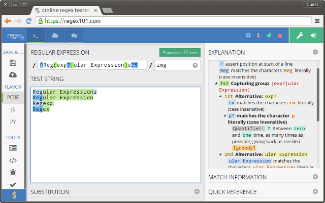
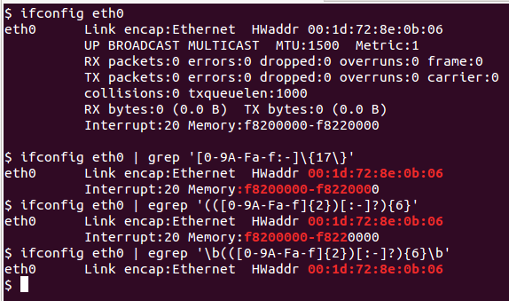
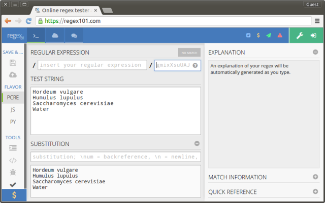

# Regular Expressions
[Brian High](https://github.com/brianhigh)  
  


## Regular Expressions

Ever need to search and replace text?

A powerful, flexible, nearly universal "wildcard" syntax is available to you. For free!

It is called, "Regular Expressions", among other names...

## Regular Expressions Meta-Example

This expression:

```
/^Reg(exp?|ular Expression)s?$/i
```

Matches these lines:

```
Regular Expressions
Regular Expression
Regexp
Regex
```

These are all common names for today's topic.

## WTF?

Let's decode this: `/^Reg(exp?|ular Expression)s?$/`


Symbol(s) | Meaning 
--------- | ------------- 
/stuff/   | The pattern sequence (stuff) is between slashes       
^         | Matches the beginning of the text (or line)  
Reg       | Matches the text string "Reg" (literally)
(stuff)   | Group stuff inside, and capture for later use
(a\|b)    | Matches "a" _or_ "b"
?         | Matches O or 1 of whater is directly to the left
$         | Matches the end of the text (or line)

## in english plz!

```
/^Reg(exp?|ular Expression)s?$/
```

Matches:

* A text string (or line) that starts (^) with "Reg"
* Followed by "ex" or "exp" or "ular Expression"
* Followed by nothing or maybe by "s"
* With nothing else remaining in the string (or line)

So, it matches the common terms used for "Regular Expressions".

## Pattern Modifiers

But wait, what about the "img" stuff on the end, after the last /?

```
/^Reg(exp?|ular Expression)s?$/img
```

Symbol(s) | Stands for | Meaning 
--------- | ---------- | ------- 
i         | insensitive| case _insensitive_
m         | multiline  | ^$ applies to lines _and_ strings
g         | global     | find _all_ matches in string


Complicated, isn't it? _Don't worry, help is on the way!_

## Regular Expressions Tester: Regex101.com



## Character classes

Beyond simple literal matches, we can also match by character classes.


Symbol(s) | Meaning 
--------- | ------------- 
\\w       | word character - alphanumeric and underscore
\\t       | tab character
\\s       | space and other "whitespace" characters
\\r       | carriage-return (an end-of-line character)
\\n       | newline (an end-of-line character)
\\d       | digit
.         | any character except end-of-line characters

The backslash character \ gives special meaning to an ordinary character.

## Custom character classes

We can make our own classes, too. Here are some examples.

Symbol(s)      | Meaning 
-------------- | ------------- 
[A-Za-z]       | alphabet letters
[A-Z]          | upper-case alphabet letters
[a-z]          | lower-case alphabet letters
[0-9.]         | digits and decimal (period)
[0-9A-Fa-f:-]  | hexadecimal digits plus colon and dash
[01]           | binary digits

## Backslashes and Escapes

If you want to include some of these special symbols as a literal string,
you may have to "escape" it with a backslash.

These symbols need to be escaped to make them literal:

```
{}[]()^$.|*+?\
```

These characters become special when preceded by a backslash.

```
dswbDSWBntr
```

\\D, \\S, \\W, and \\B mean the opposite of \\d, \\s, \\w, and \\b, respectively.

There are a few [more of these](https://www.hscripts.com/tutorials/regular-expression/metacharacter-list.php).

## Anchors

Achors are very special because they do not match any characters.

For example, ^ and $ tie a match to a location: ^=start, $=end.

\\b is an anchor for a "word-boundary" -- the beginning or ending of a word or a string like a word.

That is, a word-boundary is a zero-width boundary between a word-class
character (\w) and a non-word-class character (\W).

Why would you need that?

## Anchor example

Remember the `ifconfig` command that shows information about your network
interface? How to we match the Ethernet hardware address (HWaddr)?



This expression would also work: `' [0-9A-Fa-f:-]{17}'`

## Find and Replace

You can use pattern matching (and group-capture) for replacement (substitution).

Given these ingredients:

```
Hordeum vulgare
Humulus lupulus
Saccharomyces cerevisiae
Water
```

Abbreviate as:

```
H. vulgare
H. lupulus
S. cerevisiae
Water
```

How might you do this? What if "Water" was "dihydrogen monoxide"?

## Regex101: Substitution

To try text replacement at Regex101, press the (+) button next to the SUBSTITUTION section heading.




## Next: Lab Exercise

*_What to turn in_*:

Please turn in your final text output and the search (match) expressions and replacement expressions you used to get your list.

## Change location format

Given these locations:

```
Seattle: 47.6097° N, 122.3331° W
Paris: 48.8567° N, 2.3508° E
Bogotá: 4.5981° N, 74.0758° W
Adelaide: 34.9290° S, 138.6010° E
Casablanca: 33.5333° N, 7.5833° W
Beijing: 39.9167° N, 116.3833° E
Tokyo: 35.6833° N, 139.6833° E
```

Change the locations to used the signed format:

* Precede S latitudes and W longitudes with a minus sign.
* Remove the N, S, E, and W compass directions.

Do this in two steps (two sets of expressions). So, after your first step, copy the output text and paste it as the input string.


## Create URL with query string

Now that you have the coordinates in the signed format, try to more substitution steps:

* Replace the comma-space (", ") with "%2C+".
* Replace the city names and colon-space (": ") with this URL string:

```
https://www.google.com/search?q=
```

This should convert all locations URLs to a format like this:

```
https://www.google.com/search?q=47.6097°%2C+-122.3331°
```

... which you can use to find the specific locations of the coordinates.

Tip: These can use literal expressions with no need to group and capture.

## How could we do this in R?


## More resources

Tutorials an reference information:

* [http://www.regular-expressions.info](http://www.regular-expressions.info)

Regex testing sites:

* [https://regex101.com/](https://regex101.com/)
* [http://www.regexr.com/](http://www.regexr.com/)

Videos:

* [Regular Expressions by Roger Peng](https://www.youtube.com/watch?v=NvHjYOilOf8)
* [Regular Expressions in R by Roger Peng](https://www.youtube.com/watch?v=q8SzNKib5-4)

Books:

* [Practical Computing for Biologists](http://practicalcomputing.org/)
* [Mastering Regular Expressions, 3rd Edition](http://shop.oreilly.com/product/9780596528126.do)
